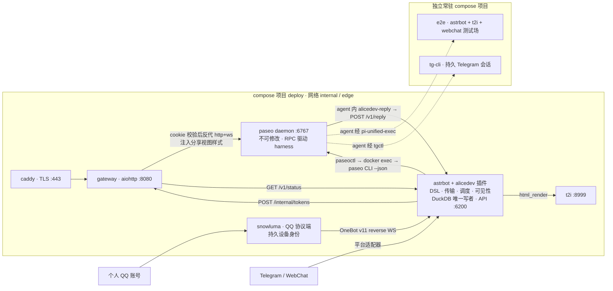
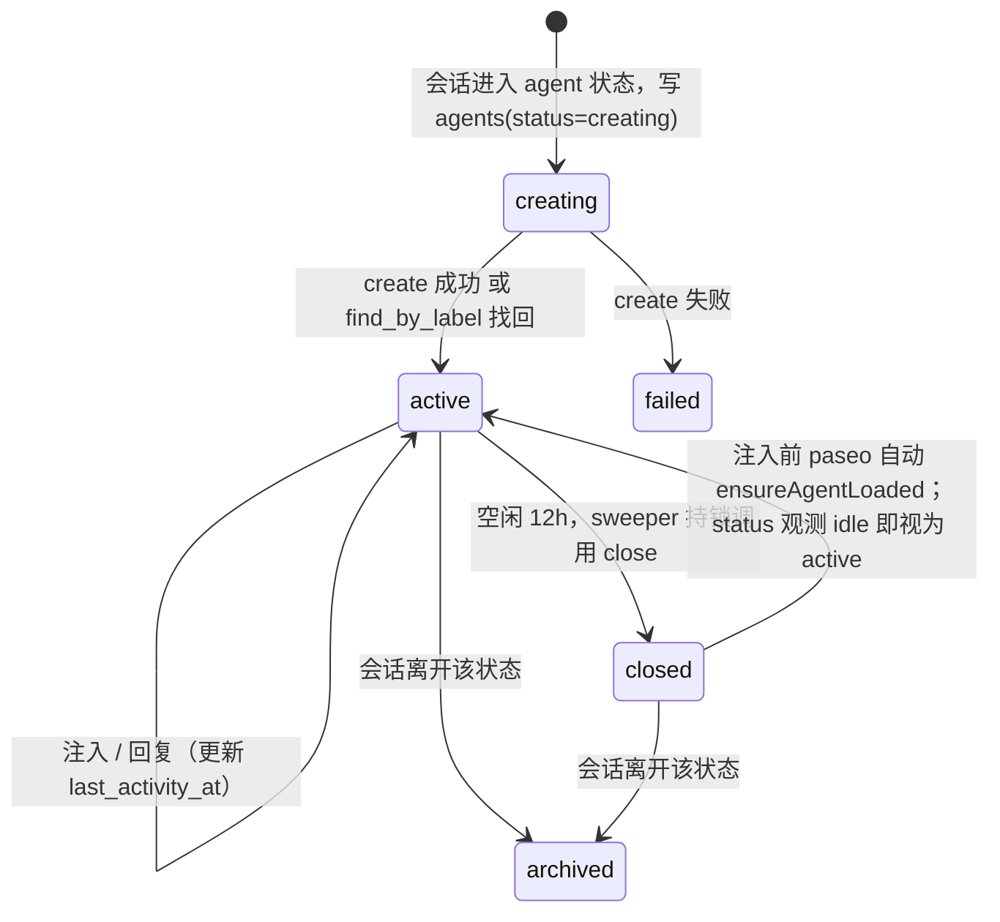
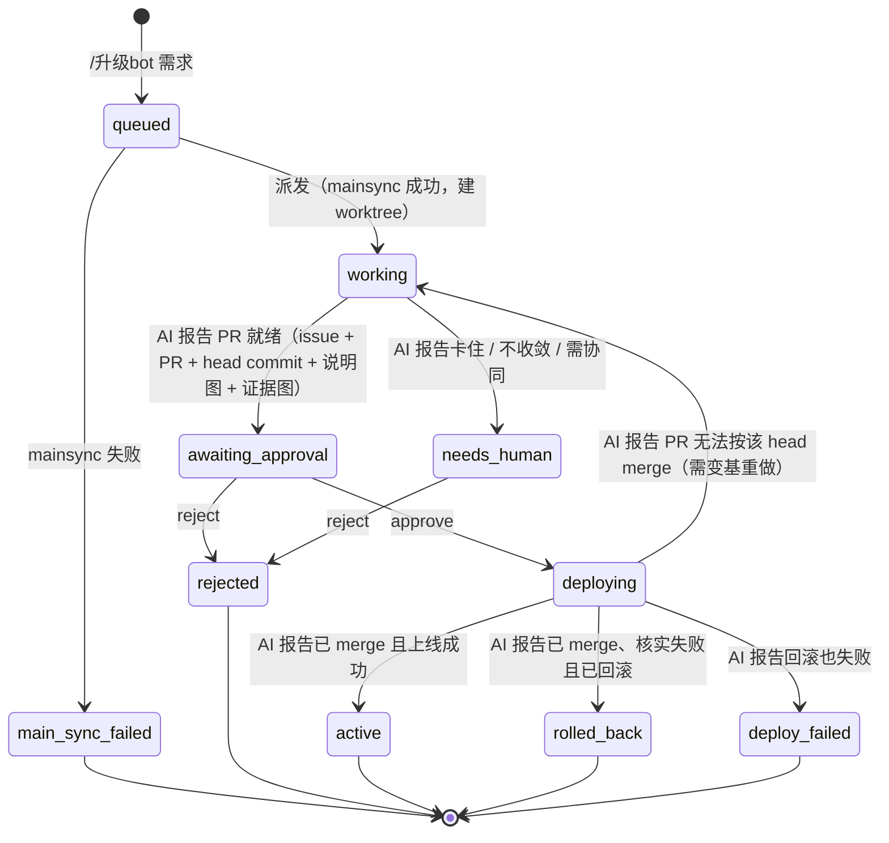

# alicedev 架构与契约

> 契约变更先改本文件，再写代码。事实依据见 `docs/research/*.md`；线上状态与待办见 `HANDOFF.md`。

## 0. 一句话

AstrBot 插件把群聊指令分成两类：**程序指令**由 bot 自己完成（会话管理、收藏、列表、帮助、分享、审批）；**AI 指令**把 prompt 交给 paseo 里的 AI，要么新开一个**会话**，要么发到已有会话（`%n` 指定，不指定就发到本群当前会话）。每个会话是某个**场景**的实例：最简单的场景只有一个对话态（`/需求`、`/帮我调查`、`/解读`），复杂的场景带挂钩仓库、worktree 和多状态（`/升级bot`：AI 迭代 bot 自身，经人批准后上线），两者共用一套抽象。会话里的 AI 通过回复把消息写进 bot 的出站队列，bot 从队列发回群。指令、消息路由、场景和用户可见的固定文字全部写在人类友好的 YAML DSL 里，可直接渲染成图片卡片。网关用一次性 token 分享 paseo 面板并公开渲染报告。

**五条不变量（违背即错）**
1. **monorepo**：alicedev 的全部代码（bot、调度、DSL、shim、e2e 基建、部署）只在本仓库。paseo 按上游原样使用：不 fork、不改源码，alicedev 只在其外面叠加运行配置（harness 产物、provider 配置）。
2. **paseo daemon 是不可修改的已部署基础设施，只是一个 daemon**：被动响应，从不主动推进流程，用 RPC 驱动各 harness（omp / pi / claude / codex…）。
   - **bot → daemon 的唯一接触面是 paseo CLI**（全部 `--json`），bot 经 `paseoctl` shim 跨容器调用；**禁止 MCP、禁止 WS、禁止自写 daemon 协议客户端**。
   - **agent → bot 的唯一通道是回复**：`alicedev-reply` → `POST /v1/reply`（§6）。bot 不读 agent transcript、不解析模型自由文本。
   - agent 里的 AI 是执行者：**不碰 paseo CLI、不起 agent、不推进流程**。会话状态由 AI 在回复里用结构化字段 `transition` 报告，由 bot 调度校验并推进（§7）。
3. **bot 侧三个独立职责**：
   - **传输**：入站把平台消息交给指令或路由；出站是消息队列，AI 与 bot 自己入队，平台适配器出队发送，入队与出队互不等待（§6）。
   - **调度**：会话状态机，按场景定义起 agent、推进状态；声明独占的场景一次只处理一个会话（§7）。
   - **可见性**：只有场景声明为可见的状态进入聊天面，其余全部内部。
4. **IaC 只声明与 provision 宿主文件，与运行时彻底解耦**：`nekoringo-iac/apps/alicedev`（OpenTofu）只把 `deploy/` 与 SOPS 注入的 `deploy/.env` 从一个 committed alicedev revision 落到 `/srv/alicedev`；`tofu apply` 成功 = 文件落地，**绝不**跑 `docker compose`、判容器健康、验 QQ 在线。运行时 bring-up 与健康监控是另一层 owner；bot 代码与 DSL（`bot/`、`templates/`）由 `deployctl` 拥有、不进 IaC 托管集（§11）。
5. **DSL 驱动，不写死指令**：指令、消息路由、场景、用户可见的固定文字全部在 `templates/` 的 YAML DSL 里声明（§3）；代码只实现有限的动作、参数类型和卡片渲染。新增或修改指令 = 改 DSL 文件，不改代码。

## 1. 进程与容器（nekoringo2）



`deploy` 项目常驻 6 个：`caddy`、`gateway`、`astrbot`、`snowluma`、`paseo`、`t2i`；一次性 init 3 个：`astrbot-init`、`snowluma-init`、`reports-init`。`e2e`、`tg-cli` 各自是独立 compose 项目，**永不随 `deploy` 下线**。

| 进程 | 语言 | 职责 |
|---|---|---|
| `astrbot` + 插件 `bot/` | Python 3.11 | **DSL**：加载与校验 `templates/`，按 DSL 分发指令与路由。**传输**：出站队列、渲染、内部 API、GitHub 预取、报告发布、收藏。**调度**：会话状态机、agent 生命周期（含 12h 空闲关闭）、当前会话指针。**可见性**：只放可见状态进聊天 |
| `snowluma` | — | 个人 QQ 的协议端与 OneBot v11 reverse-WS 客户端；登录态与设备身份在命名卷 |
| `gateway/` | Python 3.11 | 一次性 token → cookie、反代 paseo（含 WS 子协议注入与分享视图样式注入）、报告 md 渲染、状态页 |
| `paseo` | TS | **不可修改的已部署服务**，上游原样。agent 运行时 |
| `harness/omp-extension` | TS | `/chat_ingress` 命令、`chat_reply` 工具、`session_stop` 提醒（§5） |
| `harness/reply-cli` | TS（node 单文件，零依赖） | `alicedev-reply`：POST `/v1/reply`，带重试 |
| `e2e` | 专用镜像（astrbot + t2i + webchat） | 供 agent 使用的测试场；怎么用由场景 prompt 决定；内部不跑 pi，不是第二个 daemon |
| `tg-cli` | kabi-tg-cli + Telethon | 供 agent 使用的真实 Telegram 收发与取图 |
| `t2i`、`caddy` | 官方镜像 | HTML→PNG；ACME TLS |

**单写者**：只有 AstrBot 插件进程打开 `alicedev.duckdb`；所有存储变更经 `Store` 的单个 `asyncio.Lock`。其他进程通过 bot 内部 HTTP API。没有 paseo 侧 sidecar，没有 TS bridge 服务。

**内部 API 传输**：docker 网络 HTTP + 头 `X-Alicedev-Token`，不映射主机端口。

**QQ 链路**：snowluma 加入 `internal`（反向 WS）和 `edge`（QQ 登录/消息出站）网络；AstrBot 在容器内监听 `0.0.0.0:6199`，宿主机不发布 6199。协议端管理面板只绑定宿主机 netbird 接口（`PANEL_BIND_IP`），公网不可达。QQ 登录密码只在面板输入，不进入 Compose、`.env` 或仓库。

**AI 工作目录（paseo 容器 `/workspace` 卷）**：由场景决定（§3.4）。
- 无 `repo` 的场景：agent 直接在场景的 `cwd` 里工作（如 `/workspace/openalice`）。
- 有 `repo` 的场景：挂钩仓库的 fixed-main（如 `/workspace/alicedev`）**只做 fetch + fast-forward，永不开 AI、永不写**；每个会话一个从它派生的 worktree，该会话的全部 agent 只在这个 worktree 里。

## 2. 术语与标识符

- **会话**：用户可见的工作单位，某个场景的一个实例；群里用 `%n` 指代。一个会话在它的生命周期里可能先后有多个 agent（多状态场景每进入一个 agent 状态起一个），单对话态场景只有一个。
- **agent**：paseo 里为会话的某个状态运行的一个 agent（`paseo run` 的产物）；对用户不可见。
- **当前会话**：每个群有一个。会话类指令不带 `%n` 时，先取被引用的 bot 消息所属会话，没有引用才取当前会话；@bot 或私聊的自然消息同理。

| 名称 | 形式 | 说明 |
|---|---|---|
| 会话号 | `%` + 本群自增整数（`%1`、`%2`…） | 用户可见；紧跟指令名（有子指令时紧跟子指令词）：`/继续 %3 …`、`/继续%3 …`、`/升级bot approve %3` 均可；全角 `％` 等同 `%` |
| `session_id` | 全局自增整数 | 会话内部主键；`(chat_key, 会话号)` 唯一 |
| `agent_ref` | `a_` + 10 位 base32 | agent 在 bot 侧的 id；paseo label、ingress、回复都用它 |
| `chat_key` | AstrBot `event.unified_msg_origin` | 群/私聊唯一键 |
| `user_key` | `<platform_id>:<sender_id>` | 用户唯一键 |
| `msg_ref` | `m_` + 10 位 base32 | 每条注入消息 id；入站唯一键 `(chat_key, platform_message_id)` 防平台重投 |
| `reply_id` | 扩展生成 UUIDv4，每次工具调用一个，重试复用 | 入队幂等键 |
| `report_id` | `r_` + 26 位 base32（128 bit） | 报告公开 URL 的 bearer 能力 |
| `token` | 32 字节 urlsafe base64 | 一次性入口 |

## 3. DSL（`templates/`）

### 3.1 通则

`templates/` 下全部是给人读、也给 AI 写的 YAML（加 Jinja2 prompt 与 HTML 卡片），目录即注册表：

| 路径 | 声明什么 |
|---|---|
| `templates/commands/<指令名>.yaml` | 一条斜杠指令：类型、用法、参数、权限、做什么、各结果回什么话（§3.2） |
| `templates/routes.yaml` | 非斜杠消息怎么处理（§3.3） |
| `templates/scenarios/<name>/` | 场景：工作目录、状态机、各状态 prompt（§3.4） |
| `templates/messages.yaml` | 各动作结果的默认回话与系统提示（如未知指令） |
| `templates/cards/*.html`、`templates/stickers/` | 卡片模板与贴纸 |

写法约定：结构键用英文，给人看的值（指令名、参数名、说明、回话）用中文；每个文件自带 `summary` / 注释说明用途；回话与 prompt 用 Jinja2。以 `%` 开头的值要加引号（YAML 不允许普通字符串以 `%` 开头，不加会直接报错）；值中间的 `%` 不需要。代码只提供下面这些**封闭集合**：参数类型、动作、路由条件、卡片；DSL 只能组合它们，不能嵌代码。

### 3.2 指令（`templates/commands/<指令名>.yaml`）

每条指令声明 `type`：
- `program`：程序指令，不经过 AI，只能用程序动作。
- `ai`：AI 指令，只能用 AI 动作——`start` / `github` **新开会话**，或 `send` **发到已有会话**（`%n` 指定，省略则依次取被引用消息所属会话、本群当前会话）。

```yaml
name: 继续
type: ai
aliases: [continue]
summary: 向会话补充内容，唤醒 AI 继续
usage: /继续 [%会话] <内容>          # 参数顺序与可选性以 usage 为准：[] 可省略，<> 必填
examples:
  - /继续 再看看移动端的情况
  - /继续 %3 这个方案的风险呢
  - （引用 AI 的回复）/继续 展开说说第二点
permission: all                     # all | owner（会话创建者或管理员）| admin
args:
  会话: session
  内容: text
do:
  send:
    session: 会话
    text: |
      群友「{{ sender.name }}」补充：
      {{ 内容 }}
say:                                # 覆盖 messages.yaml 里该动作结果的默认回话
  not_conversational: "%{{ 会话.no }} 现在不接受对话，可以用 /会话 %{{ 会话.no }} 看看它的状态。"
```

```yaml
name: 切换
type: program
summary: 把本群当前会话切换到指定会话
usage: /切换 %会话
examples: [/切换 %2]
permission: all
args:
  会话: session
do:
  session_switch: { session: 会话 }
```

**参数类型**（封闭集合）：`session`（`%n`，只能紧跟指令名，有子指令时紧跟子指令词；可省略时依次取被引用消息所属会话、本群当前会话；在模板里提供 `.no`、`.name`、`.state`）、`text`（余下全部文本）、`word`（一个词）、`int`、`page`（页码，缺省 1）、`github_ref`（issue/PR 链接或默认仓库 `#n`）、`mentions`（@ 的用户列表）、`quoted`（必须引用一条消息）。

**动作**（封闭集合；每个动作有固定的结果键，回话取 `say` 覆盖或 `messages.yaml` 默认）：

| 类型 | 动作 | 参数 | 结果键 |
|---|---|---|---|
| ai | `start` | `scenario`、`text` | `created`、`queued`、`failed` |
| ai | `github` | `ref`、`scenarios: { issue, pr }` | `created`、`fetch_failed`、`failed` |
| ai | `send` | `session`、`text` | `ok`、`not_found`、`not_conversational`、`busy` |
| program | `session_show` | `session` | 会话卡（§3.5） |
| program | `session_switch` | `session` | `ok`、`not_found` |
| program | `session_rename` | `session`、`name` | `ok`、`not_found` |
| program | `session_archive` | `session` | `ok`、`not_found` |
| program | `human` | `session`、`command` | `ok`、`not_found`、`not_allowed` |
| program | `share` | `session`、`to`（mentions，缺省发起人） | `ok`、`not_found`、`not_ready` |
| program | `favorite` | `quoted` | `ok`、`image_failed` |
| program | `list` | `source: sessions \| favorites`、`scenario?`、`archived?`、`card`、`page` | 卡片图 |
| program | `help` | `command?` | 帮助卡或指令卡（§3.5） |

一个指令可以带子指令（如 `/升级bot approve [%会话]`）：`subcommands:` 下每项是一份同结构的指令声明，`name` 为子指令词，可与父指令类型不同。

### 3.3 消息路由（`templates/routes.yaml`）

非斜杠消息按顺序匹配第一条；条件是封闭集合：`github_link`（消息只有一个 issue/PR 链接）、`addressed`（@bot 或私聊的自然消息）。可用变量：`message`（消息文本）、`sender{id,name}`、`chat{key,name}`、`quoted`。动作参数的解析规则与指令相同，`send` 省略 `session` 即按 §2 取被引用消息所属会话或当前会话。

```yaml
- when: github_link
  do: { github: { ref: "{{ message }}", scenarios: { issue: github-issue, pr: github-pr } } }
- when: addressed
  do: { send: { text: "{{ message }}" } }
  say: { not_found: 当前没有会话，请先用 /需求 或 /帮我调查 开始，或用 /会话列表 看看已有会话。 }
```

### 3.4 场景（`templates/scenarios/<name>/`）

目录即注册表：`scenario.yaml` 加每个 agent 状态一份 Jinja2 prompt。场景 = 工作目录（`cwd`，或挂钩仓库 + worktree 生命周期）+ 状态机 + 各状态 prompt。场景由 AI 指令或路由的 `start` / `github` 动作启动（§3.2）。

**最简单的场景：只有一个对话态**（`templates/scenarios/requirement/scenario.yaml`）

```yaml
name: requirement
title: "需求 · {{ text }}"          # 会话名称（Jinja，截断到固定长度；可用 /重命名 修改）
description: 记录群友需求并交给 AI 分析
provider: omp-alicedev              # paseo provider id；模型与 thinking 由 daemon provider 配置决定
cwd: /workspace/openalice
initial: discussing
states:
  discussing:
    kind: agent
    prompt: discussing.md
    reply:
      kinds: [text, image_template]
      image_templates: [requirement_summary, generic_card]
      stickers: []
      max_text_chars: 600
```

**复杂场景：挂钩仓库、独占、多状态**（`templates/scenarios/upgrade-bot/scenario.yaml`，完整定义见 §13）

```yaml
name: upgrade-bot
title: "升级 · {{ text }}"
provider: <paseo provider id>
repo: { fixed_main: /workspace/alicedev, base: main }   # 与 cwd 二选一
exclusive: true                                       # 同场景一次一个会话，其余排队
initial: working
states:
  working:
    kind: agent
    prompt: working.md
    next: [awaiting_approval, needs_human]
  awaiting_approval:
    kind: human
    data: [issue, pr, commit]
    reply: { kinds: [image, text] }
    commands: { approve: deploying, reject: rejected }
  # …
```

**字段**
- `cwd` 与 `repo` 二选一：`cwd` = agent 直接在该目录工作；`repo` = 派发时对齐 fixed-main 并为会话建 worktree，结束时归档。
- `exclusive`：默认 `false`，会话创建即派发；`true` 时同场景最多一个未结束会话，其余 `queued`。

**状态 `kind`**
- `agent`：进入时在会话工作目录起一个新 agent，首轮 prompt 为该状态模板的渲染结果。带 `reply` 的是**对话态**：AI 的回复按 `reply` 规格进聊天面，群友可以继续对话（`send`），`transition` 可选；不带 `reply` 的是**内部态**：不进聊天面、不接受 `send`，AI 只能报告 `transition`。`next` 列出可报告的目标状态，缺省为空（单对话态场景就是如此）。
- `human`：等待人工指令，`commands` 把人工指令名映射到目标状态（群里怎么发由指令 DSL 的 `human` 动作决定）；可见。
- `terminal`：会话结束，可见；进入时停掉 agent、有 worktree 则归档、释放独占。

**可见状态** = human、terminal、对话态 agent；只有进入可见状态或在对话态里的回复会进聊天面。

`data`：进入该状态时 `transition.data` 必须带的键，累积进会话 `data`。human/terminal 状态的 `reply` 规格约束 AI 报告进入它时附带的那条消息；由调度或人工指令进入时，消息是 `messages.yaml` 里的固定文字。`share: true`：进入该状态时 bot 为会话创建者签发一次性 paseo 链接（§8），附在这条消息后面；AI 不签发链接。

**内建状态**（所有场景共有）：`queued`（等待派发）、`main_sync_failed`（terminal，`share: true`，派发时 fixed-main 对齐失败，仅 `repo` 场景）、`failed`（terminal，进入某个 agent 状态时 agent 创建失败，附原因）、`archived`（terminal，`session_archive` 从任意未结束状态进入）。

**prompt 变量**：`text`、`sender{id,name}`、`chat{key,name}`、`quoted{sender,text,images[]}`、`images[]`、`github{kind,owner,repo,number,title,body,labels[],state,url}`、`session{no,name}`、`reports_dir`（该会话的报告目录 `REPORTS_ROOT/s<session_id>/`）、`repo{fixed_main,worktree,branch,base_sha}`（仅 `repo` 场景）、`data`、`state`、`next[]`、`agent_ref`。prompt 里包含 system 段（`paseo run` 没有 systemPrompt 参数，omp 的 system prompt 由用户自管）。bot 在渲染结果末尾追加「回复方式」段：本状态 `reply` 规格、允许的 `next` 与各目标要求的 `data`、`chat_reply` 用法、长内容走 image_template。

### 3.5 校验与图片渲染

- **加载即校验**：`initialize()`（含插件热重载）把 DSL 解析成类型化模型。未知键、未知动作/参数类型/路由条件/卡片、`type` 与动作类别不符、引用不存在的场景或状态、指令名与别名冲突、`usage` 与 `args` 不一致、`examples` 里有按 `usage` 解析不通过的（去掉开头括号说明后）、Jinja 引用了不存在的变量，都会让**该文件**被拒绝，错误带文件与行号写日志并出现在 `/v1/status` 的 `dsl_errors`；其余文件照常生效。依赖被拒文件的指令一并不生效。
- **离线工具**：`python -m alicedev.dsl check templates/` 做同样的校验；`python -m alicedev.dsl card <指令名|场景名>` 在本地出图。AI 新增或修改指令后必须跑这两个命令，人工审核直接看出的图。
- **图片卡片**（经 t2i，模板在 `templates/cards/`）：
  - 帮助卡（`/alicedev`）：从全部指令 DSL 生成，分「AI 指令」「程序指令」两组，列出 `usage`、`summary` 和权限标记，附本群当前会话 `%n` 与名称、状态。
  - 指令卡（`/alicedev <指令名>`）：`summary`、`usage`、参数说明、`examples`、权限；新开会话的指令附场景流程图（状态、转移、人工指令，全部取自场景 DSL）。
  - 会话卡（`/会话 [%会话]`）：`%n`、名称、场景、当前状态（在场景流程图上标出）、创建人与时间、最近活动、是否当前会话。
  - 会话列表卡（`/会话列表`）：`%n`、名称、场景、状态、最近活动，标出当前会话。
  - 审核用：`/升级bot` 改动了 DSL 时，`working` 状态把受影响指令与场景的卡片放进证据图（§13.2）。

## 4. bot → paseo 控制面（paseo CLI，经 shim）

bot 侧 `PaseoControl`（`bot/alicedev/paseo/`）的每个操作 = 一次 `tools/paseoctl` 调用 = `docker exec alicedev-paseo paseo <cmd> … --json`。bot 只解析 CLI 的 JSON 输出。**具体参数与 JSON 形状以在 paseo 容器内 `paseo <cmd> --help` / `--json` 实测为准。**

| 操作 | paseo CLI（均 `--json`；daemon 地址由 shim 固定；CLI 以 root 执行，`git` 类操作以 `paseo` 用户执行） |
|---|---|
| `create(agent_ref, provider, cwd, title, initial_prompt, workspace_id?)` | `paseo run "<initial_prompt>" --background --provider <provider_id> --cwd <cwd> --title <title> --label alicedev=<agent_ref> [--workspace <workspace_id>]` |
| `find_by_label(agent_ref)` | `paseo ls` 过滤 label |
| `send(agent_id, text)` | `paseo send <agent_id> "<text>" --no-wait`（不加 `--no-wait` 会等 agent 这一轮跑完才返回） |
| `status(agent_id)` → idle/running/permission/closed/error | `paseo inspect <agent_id>` |
| `close(agent_id)`（可恢复） | `paseo stop <agent_id>`（paseo 0.8.0 对 idle agent 是空操作，没有释放 runtime 的命令） |
| `archive(agent_id)` | `paseo archive <agent_id> --force`（agent 仍在运行时也归档） |
| `worktree_create(repo, base_ref, slug)` → workspace_id + 目录 | `paseo workspace create --isolation worktree --path <repo> --mode branch-off --base <base_ref> --worktree-slug <slug>` |
| `worktree_archive(workspace_id)` | `paseo workspace archive <workspace_id>` |
| `workspace_register(path)` → workspace_id | `paseo workspace create --isolation local --path <path>`：`cwd` 场景为每个会话登记一个 local workspace（agent 与分享链接都用它）；`repo` 场景在 `main_sync_failed` 时登记 fixed-main（只为让人能经分享链接查看，不在其中起 agent） |

**agent 状态机（每个 agent_ref 一把 `asyncio.Lock` 作为租约）**



- 创建：写 `agents(creating)` → `create`（首轮 prompt 以 ingress 命令注入，omp 扩展在模型前拦截，msg id 不入模型上下文）→ 响应丢失时 `find_by_label`（label `alicedev=agent_ref`）找回 → 写 `agent_id` → 转 `active`。`create` 与 `find_by_label` 都失败 → 会话进入内建 `failed`（附原因）。
- 注入：持锁 → `status`；`running/permission` 则每 2s 轮询直到 idle（上限 10 min，超时为 `send` 的 `busy` 结果）→ `send` → 写 `messages` → 更新 `last_activity_at`。同一 agent 严格串行；不同 agent 并行。
- 关闭：sweeper 每 10 min 扫对话态 agent 中 `status=active AND last_activity_at < now-12h` 的；持锁 → `status` 非 running/permission → `close` → `status=closed`。幂等，会话状态不变；由于 `stop` 对 idle agent 是空操作，关闭实际只落在 `agents.status`，下次注入时 paseo 自动加载。时钟只有一个：`agents.last_activity_at`（注入时间与入队时间的较大者），随 DuckDB 持久化。
- 会话离开某状态或结束时，该状态的 agent `archive`。

## 5. ingress 命令与 omp 扩展

omp 在 rpc/rpc-ui 下**不触发** `input` 事件（`oh-my-pi/.../types.ts:908`，`input-controller.ts:766`），但注册的扩展命令在模型之前被处理（`agent-session.ts:6126-6147`）。因此注入文本固定为：

```
/chat_ingress {"agent":"a_…","msg":"m_…","text":"<渲染后的 prompt 或群友发来的内容>"}
```

（单行 JSON；`text` 内换行按 JSON 转义。）

扩展 `harness/omp-extension`（核心逻辑在 `harness/core`，无 harness 依赖）：

1. `pi.registerCommand("chat_ingress")`：解析 JSON → `pending.push({agent,msg,text})` → `pi.appendEntry("alicedev.pending", {agent,msg})` → `pi.sendUserMessage(text)`。模型只看到 `text`。
2. `pi.registerTool("chat_reply")`：参数 = `{ reply?: ReplyPayload; transition?: Transition }`（§6）。执行：生成/复用 `reply_id`；`pi.exec("alicedev-reply", ["--agent", a, "--reply-id", id, "--msgs", "m1,m2", "--json", payload])`；退出码 0 且 stdout `{"status":"queued"|"replayed"}` → 把**当前全部 pending** 标记 consumed（`appendEntry("alicedev.consumed", {msgs, reply_id})`），返回成功；非 0 → 把 stderr 原样返回给模型，pending 不变。consumed = bot 已入队，与平台是否已发出无关。一条回复覆盖此前收到的所有消息（聊天语义）。
3. `pi.on("session_stop")`：若 `event.signal.aborted` 或 ctx 正在关闭 → 不干预。否则若 pending 非空且尚未对当前 pending 集合提醒过（`appendEntry("alicedev.reminded", {msgs})` 持久化）→ 返回 `{continue:true, additionalContext}`，内容为固定模板 + JSON 编码的原文。同一 pending 集合只提醒一次。
4. `session_start`：扫 `getBranch()` 重建 pending/consumed/reminded。
5. 加载方式：paseo custom provider `omp-alicedev`：`{extends:"omp", command:["omp","-e","/opt/alicedev/omp-extension"]}`（replace 模式，argv[0] 必须是 omp；`provider-registry.ts:833-862`，`omp/runtime.ts:83-88`）。

## 6. 消息：入队 API 与出队（`http://astrbot:6200`，头 `X-Alicedev-Token`）

```ts
type ReplyPayload =
  | { kind: "text"; text: string; sticker?: string }
  | { kind: "text_template"; template: string; fields: Record<string, string>; sticker?: string }
  | { kind: "image_template"; template: string; fields: Record<string, unknown>; sticker?: string }
  | { kind: "image"; paths: string[]; caption?: string }    // paths 在 REPORTS_ROOT 下，以平台 Image 内联发送
  | { kind: "sticker"; sticker: string }
  | { kind: "file"; path: string; caption?: string };      // path 在 REPORTS_ROOT 下

type Transition = { state: string; data?: Record<string, string> };

POST /v1/reply { agent; reply_id; msgs: string[]; reply?: ReplyPayload; transition?: Transition }
  → 202 { status: "queued" | "replayed"; report_url?: string }
  → 400 { error: invalid_payload | kind_not_allowed | template_unknown | path_outside_root | file_not_regular
               | reply_required | reply_not_visible | transition_required
               | transition_not_allowed | transition_data_missing }
  → 404 { error: agent_unknown }
  → 409 { error: reply_id_conflict | agent_not_current }
GET  /v1/agents/{agent} → { agent, session_no, chat_key, state, status, reply_spec }
GET  /v1/status → { ok, generation, uptime_s, platforms[], commands[], scenarios[], dsl_errors[],
                    sessions:{active, queued}, agents:{active, closed} }
GET  /v1/health → 200 { generation, revision }   // 免鉴权；reply-cli 重连探测；revision = bot/REVISION（deployrun 写入），缺失为 "unknown"
```

**入队规则**（agent 所属会话的当前状态必须仍是该 agent 服务的状态，否则 409 `agent_not_current`；`reply` 与 `transition` 至少带一个，否则 `invalid_payload`）
- 当前是**对话态**：`reply` 入队，发往会话的 `chat_key`；`transition` 可选。
- 当前是**内部态**：`transition` 必填（`transition_required`）；除非目标状态可见，否则不得带 `reply`（`reply_not_visible`）。
- 带 `transition`：目标必须在 `next` 内（`transition_not_allowed`），目标声明的 `data` 必须齐全（`transition_data_missing`）；目标为 human/terminal 时 `reply` 必填（`reply_required`）。
- `reply` 的规格：带 `transition` 且目标可见时按目标状态的 `reply` 规格校验，否则按当前状态的。
- 处理：持 Store 锁 → `reply_id` 已存在：摘要相同返回 `replayed`，不同返回 409 → 校验 → 在同一事务里写 outbox 行并应用 transition → 释放锁 → 返回 202。不触碰平台。调度在进程内收到状态变化通知（§7）。
- **长内容**：`text` 超过 `max_text_chars` 在出队时改走 `generic_card` 图片模板，不拒绝。
- **`file` 发布（入队时完成）**：`os.path.realpath(path)` 以 `REPORTS_ROOT/` 为前缀、`lstat` 为常规文件、路径各段无符号链接；生成 `report_id`；原子复制到 `REPORTS_ROOT/_published/<report_id>/<basename>`（临时文件 + rename）；写 `reports`；`.md` 的消息内容为 `https://<host>/_alicedev/r/<report_id>/<basename>`，其他扩展名以文件组件发送。`image` 的路径做同样校验。

**出队**：outbox worker 按 `chat_key` 先进先出取 `queued` 行 → 渲染（长文本转卡片、`image_template` 经 t2i；AI 的消息带会话标记 `%n 名称`，文字消息为前缀、卡片为角标，让群友知道是哪个会话、回复时该指哪个）→ 平台适配器发送 → 平台返回消息 id 时写 `outbound(platform_message_id → session_id)` → 标记 `sent`；发送失败标记 `failed` 并按退避重试。bot 重启或插件重载后继续消费未出队的行。出队至少一次：发送成功后、写 `sent` 前崩溃会重发。程序指令与调度自己的回话也以同样的行入队。

**插件生命周期**：`initialize()`：加载并校验 DSL → 打开 Store（一次）→ 启动 aiohttp `TCPSite`（`reuse_port`）→ 启动 sweeper、outbox worker、调度（从 DuckDB 恢复未结束会话）；`generation` 自增。`terminate()`：标记 draining（`/v1/*` 返回 503）→ 等待在途请求 ≤10s → 取消并等待后台任务 → 关站 → 关 Store。插件热重载 = `terminate()` + 新代码 `initialize()`。reply-cli 遇 503/连接拒绝按 1,2,4,8s 重试至 30s。

## 7. 调度：会话状态机

- **新开会话**：AI 指令或路由的 `start` / `github` 动作 → 分配本群下一个会话号 `%n`，建会话（名称由场景 `title` 渲染）→ 设为本群当前会话 → 派发 → 按结果键回话（`created` / `queued` / `failed`）。入站以 `(chat_key, platform_message_id)` 去重，平台重投不重复建会话。
- **派发**：非独占场景立即派发；独占场景在同场景已有未结束会话时保持 `queued`，前一个结束后按创建顺序派发。`repo` 场景派发时先 `mainsync align --repo <fixed_main>`（在 paseo 容器内 `git fetch` + fast-forward），非 ff / 脏 / 冲突 → `workspace_register(<fixed_main>)`（已登记则复用），workspace_id 记入该会话 → `main_sync_failed`（按 `share: true` 附链接，人手动清理）；成功则 `worktree_create(<fixed_main>, <base>, s<session_id>)`，记录 `workspace_id`、worktree 路径、`base_sha`。然后进入 `initial`。
- **进入 agent 状态**：在会话工作目录起 agent（`provider` 取场景，原样传给 `--provider`，如 `omp-alicedev/opencode-go/muse-spark-1.3-contributor`；`cwd` 场景用会话的 local workspace，`repo` 场景用会话 worktree，均带 `--workspace`），首轮 = `/chat_ingress` 包裹的状态 prompt；写 `agents(session_id, state)`。
- **发到已有会话**（`send`）：目标会话 = 显式 `%n` > 被引用消息所属会话 > 本群当前会话。被引用消息所属会话按 `outbound` 查；AstrBot 主动发送拿不到平台消息 id 时，按被引用消息首行的会话标记 `%n` 解析 → 必须处于对话态 → 注入该状态的 agent（§4 注入）→ 设为本群当前会话；否则按结果键回话。
- **当前会话**：每群一个指针（`chat_current_sessions`）。新开会话、`send` 到某会话、`/切换` 都会改它；当前会话结束时指针清空。
- **推进**：agent 状态之间只由当前 agent 回复里的 `transition` 推进（§6）；AI 停下而未回复时由 §5.3 的提醒兜底。调度不读 agent 内容、不解析自由文本、不用 `wait`/`inspect` 判断阶段是否完成。human 状态由 `human` 动作推进。
- **结束**：进入 terminal → 停掉并归档 agent → 有 worktree 则 `worktree_archive` → 释放独占并派发同场景下一个会话 → 若是本群当前会话则清空指针。会话号不复用。
- **恢复**：会话与 agent 状态全部在 DuckDB。bot 重启或插件重载后，调度恢复未结束会话，不重起已存在的 agent；agent 在 paseo 里照常运行，回复在 bot 恢复后照常入队。bot 起不来时 paseo 仍在，人经 paseo 面板让 AI 修复。

单对话态场景（§13.1）只用到其中的新开会话、进入 agent 状态、发到已有会话、归档（或创建失败）结束。

## 8. 网关

**威胁模型（明确决定）**：分享链接的接收者是社区内受信开发者。token 门槛阻止外部人进入；一旦持有 cookie，即可使用整个 paseo daemon UI。报告是公开 bearer URL（128 bit id），因为它们被贴进群供多人反复打开。

- `GET /t/<token>` 与 `HEAD /t/<token>`：单进程校验 token 并 `peek`，**不消费**；
  返回 preview landing（`Cache-Control: no-store`、`Referrer-Policy: no-referrer`、
  `X-Robots-Tag: noindex`）。GET 页面用 JavaScript 自动向同一路径提交 `POST`，
  同时保留可见按钮 fallback；HEAD 只返回 headers，不消费 token。
- `POST /t/<token>`：无 `await` 的单进程原子 consume；成功设 cookie
  `alicedev_s=<b64url(json{iat,exp,sub})>.<hmac-sha256>` 并返回 `303 See Other`
  到 `/_alicedev/?go=<urlencoded target>`；`Path=/; Secure; HttpOnly; SameSite=Lax;
  Max-Age=2592000`；服务端校验 `exp`，常量时间比较 HMAC。无效/已消费/过期返回 403。
- cookie 校验：除 `/t/*`、`/_alicedev/r/*`、`/_alicedev/static/*`、`/_alicedev/health` 外全部要求合法 cookie；失败 → 403 页面。
- `/_alicedev/`：状态页（取 bot `/v1/status`），显示 bot 状态、指令、场景列表与「进入会话」按钮（`go`）。
- `/_alicedev/r/<report_id>/<basename>`：只读挂载 `REPORTS_ROOT/_published`；`report_id` 正则 `^r_[a-z2-7]{26}$`，`basename` 不含 `/`、`..`；`.md` → markdown-it-py（`html=False`）+ mdit-py-plugins（table、strikethrough、footnote、tasklists、deflist、front_matter、texmath）+ pygments；mermaid 客户端渲染（自带静态 js，`securityLevel:"strict"`）；其他扩展名白名单直出。响应头 `X-Robots-Tag: noindex`，`Referrer-Policy: no-referrer`；无目录列表。
- 其余路径 → 反代 `http://paseo:6767`。HTTP：注入 `Authorization: Bearer $PASEO_PASSWORD`。WS（浏览器 ↔ paseo UI 的通道，与 bot 无关）：网关终止浏览器 WS（不转发浏览器的 `Sec-WebSocket-Protocol`/`Authorization`），另起上游 WS，带 `Authorization` + 子协议 `paseo.bearer.<pw>`，双向泵；不把上游子协议回显给浏览器。上游 `Host`=公共域名（paseo 需 `PASEO_HOSTNAMES` 含 `alicedev.237575.xyz`）；`Origin` 置为 `https://alicedev.237575.xyz` 或不发。
- **分享视图**：分享链接打开的 paseo app 只保留右侧 agent 操作区（会话标签、对话、输入框），去掉左侧控制栏及其导航入口。网关对反代的每个 `text/html` 响应在 `</head>` 前注入 `<link rel="stylesheet" href="/_alicedev/static/paseo-view.css">`（上游压缩的响应先解压再注入，并去掉 `Content-Length` 让其重算）；样式表由网关自带，只做隐藏，不改 paseo 源码、不注入脚本。选择器绑定当前部署的 paseo 版本，升级 paseo 时重新核对。这只是界面收敛，不是授权边界（见威胁模型）。分享目标：会话有 agent 时为最近一个 agent 的 `/h/<server>/workspace/<workspace>?open=agent%3A<agent>`；没有 agent 时为会话记录的 `workspace_id`（会话 worktree，或 `main_sync_failed` 时登记的 fixed-main，§4 `workspace_register`）。不带任何 paseo 私有参数。
- `PASEO_PASSWORD` 必须非空（为空时 paseo daemon 不做鉴权）。
- 访问日志脱敏：`/t/<token>` 记为 `/t/***`；不记录 cookie。

## 9. 指令与权限

配置（`bot/_conf_schema.json`）：`allowed_chats: string[]`（chat_key 白名单；空 = 全部允许）、`admin_users: string[]`（user_key）、`internal_token`、`gateway_url`、`public_base_url`、`reports_root`、`github_token?`、`default_repo: TraderAlice/OpenAlice`。

分发：单个 `@filter.event_message_type(ALL)` 入口；以 `/` 或 `／` 开头的按指令 DSL 解析，其余按 `routes.yaml`。中间件顺序：白名单 → 解析（指令名/别名 → 子指令词 → 紧跟的 `%n`（`%`/`％` 同义）→ 按 `usage` 取其余参数、按类型解析）→ 权限 → 动作 → 按结果键回话。权限不足时私下不回（避免刷屏），日志记录。`owner` 权限 = 该会话创建者或管理员。

**内置指令**（每条都是 `templates/commands/` 下一个文件；动作列只写关键参数）

AI 指令：

| 指令 | usage | 动作 | 权限 |
|---|---|---|---|
| 需求 | `/需求 <内容>` | `start`（scenario: requirement） | all |
| 帮我调查 | `/帮我调查 <内容>` | `start`（scenario: investigate） | all |
| 解读 | `/解读 <链接>` | `github`（scenarios: { issue: github-issue, pr: github-pr }） | all |
| 升级bot | `/升级bot <需求>` | `start`（scenario: upgrade-bot） | admin |
| 继续 | `/继续 [%会话] <内容>` | `send` | all |

程序指令：

| 指令 | usage | 动作 | 权限 |
|---|---|---|---|
| 会话列表 | `/会话列表 [页]`；子指令 `/会话列表 全部 [页]` 含已结束的 | `list`（source: sessions；子指令 archived: true） | all |
| 会话 | `/会话 [%会话]` | `session_show` | all |
| 切换 | `/切换 %会话` | `session_switch` | all |
| 重命名 | `/重命名 [%会话] <名称>` | `session_rename` | owner |
| 归档 | `/归档 [%会话]` | `session_archive` | owner |
| 链接 | `/链接 [%会话] [@用户…]` | `share` | admin |
| 升级bot 子指令 | `/升级bot approve [%会话]`、`/升级bot reject [%会话]` | `human`（command: approve / reject） | admin |
| 需求列表 | `/需求列表 [页]` | `list`（source: sessions，scenario: requirement，archived: true） | all |
| 收藏 | `/收藏`（引用一条消息） | `favorite` | all |
| 收藏夹 | `/收藏夹 [页]` | `list`（source: favorites） | all |
| alicedev | `/alicedev [指令名]` | `help` | all |

`share` 动作：每个被 @ 的用户一个 token（`user_key` 记入 `tokens_issued`），无 @ 给发起人；逐条 `[At, Plain(url)]`。`favorite` 动作：原作者、文本、图片落盘 `data/plugin_data/alicedev/images/`、收藏人。`list` 每页 10 条，页脚 `第 x/y 页 · /<指令> n`。

## 10. DuckDB schema（`bot/alicedev/store/schema.sql`，`schema_version` 表）

```sql
sessions(session_id PK, chat_key, no, scenario, name, created_by, input JSON, state, workspace_id, worktree_path,
         base_sha, data JSON, created_at, updated_at, UNIQUE(chat_key, no))
         -- no：本群会话号；input：触发时的 prompt 变量（text、sender、chat、quoted、images、github）
         -- state：场景定义的状态 + 内建 queued / main_sync_failed / failed / archived
         -- 会话的「最近活动」取其各 agent 的 last_activity_at 最大值，不单独存
chat_current_sessions(chat_key PK, session_id, updated_at)
agents(agent_ref PK, session_id, state, provider, agent_id, workspace_id, server_id,
       status, legacy_ref UNIQUE, created_at, last_activity_at)
       -- state：该 agent 服务的会话状态；status：§4 agent 状态机
       -- legacy_ref：v2 迁移前的 s_… 会话 ref（旧 agent 的 label 与回复仍用它）
messages(msg_ref PK, agent_ref, chat_key, platform_message_id, sender_key, text, session_id, created_at,
         UNIQUE(chat_key, platform_message_id))
outbox(reply_id PK, seq, chat_key, session_id, agent_ref, msgs JSON, payload JSON, payload_sha256,
       state, attempts, next_attempt_at, last_error, platform_message_ids JSON, created_at, updated_at)
       -- seq：同一 chat_key 内的出队顺序
       -- state: queued | sent | failed；程序指令与调度自己的回话 agent_ref 为空，与会话无关时 session_id 也为空
outbound(platform_message_id PK, chat_key, session_id, created_at)   -- session_id：消息关于哪个会话；无关会话的程序回话为空
favorites(id PK, chat_key, saver_key, saver_name, author_key, author_name, text, images JSON, platform_message_id, created_at)
reports(report_id PK, session_id, source_path, published_path, created_at)
tokens_issued(token_id PK, session_id, user_key, issued_by, target, issued_at, expires_at)   -- 审计
```

## 11. 部署（`deploy/`）

- `docker-compose.yml`（项目 `deploy`）：`caddy`、`gateway`、`astrbot`、`snowluma`、`t2i`、`paseo` + 一次性 `astrbot-init`、`snowluma-init`、`reports-init`；`.env.example`：`ALICEDEV_HOST`、`TELEGRAM_BOT_TOKEN`、`PASEO_PASSWORD`、`ALICEDEV_INTERNAL_TOKEN`、`GATEWAY_SECRET`、`ASTRBOT_DASHBOARD_INITIAL_PASSWORD`、`ONEBOT_ACCESS_TOKEN`（aiocqhttp 反向 WS 与 snowluma 共用）、`PANEL_BIND_IP`（管理面板绑定的 netbird 接口 IP）、`OPENCODE_API_KEY`、`VNC_PASSWD?`、`GITHUB_TOKEN?`。
- 卷：`astrbot_data`；snowluma 的 `qq-gateway-data`/`qq-client-config`/`qq-client-data`（持久设备身份，重启不掉线）；`paseo_home`（daemon 与 harness 配置，用户自管）；`workspace`（各场景的 `cwd`、fixed-main 与会话 worktree）；`reports`（paseo 与 astrbot 同路径挂载 `/srv/alicedev/reports` rw；gateway 挂 `_published` ro）。
- snowluma：镜像 `motricseven7/snowluma`；反向 WS 由 `deploy/astrbot/snowluma_onebot.json` seed 为 `wsClients.url=ws://astrbot:6199`（token `ONEBOT_ACCESS_TOKEN`）。面板（noVNC `6081` / WebUI `5099`）只绑 `${PANEL_BIND_IP}`，OneBot 端口不发布宿主机。首次 QQ 登录是运行时人工步骤（noVNC 扫码）。
- paseo 镜像：上游 paseo 原样，不 fork、不改源码；alicedev 只叠加运行层 `deploy/paseo/Dockerfile`：`make harness` 产出的 `/opt/alicedev/{omp-extension,reply-cli}`、声明 `omp` 与 `omp-alicedev` provider 的 daemon 配置、entrypoint，以及 agent 需要的 `omp`（bun）、`git`、`gh`、docker CLI、agent-browser + Chromium、带 bot 依赖与 pytest 的 Python 环境（供 `python -m alicedev.dsl` 与测试）。基础镜像由 `docker/base/Dockerfile` 以 `EXPO_PUBLIC_PASEO_SELFHOSTED=true` 构建（网关的自托管 manifest 依赖它）。
- astrbot 镜像：固定 digest 的上游 AstrBot，加 docker CLI 与预装的 `bot/requirements.txt` 依赖（`deploy/astrbot/Dockerfile`）；astrbot 与 paseo 都挂 `/var/run/docker.sock`，paseo 用户属宿主 docker 组（`DOCKER_GID`）。
- astrbot 挂载：插件目录 `/AstrBot/data/plugins/alicedev` ← 检出的 `bot/`；`/AstrBot/alicedev-templates` ← 检出的 `templates/`。`cmd_config.json` 预置 `telegram` + `webchat` + `aiocqhttp`（reverse WS `0.0.0.0:6199`）+ `t2i_endpoint=http://t2i:8999`。
- **bot 与 DSL 交付**：宿主上一份由 `deployctl` 拥有的 alicedev git 检出，astrbot 挂载其中的 `bot/` 与 `templates/`。部署 = 检出切到 main 上的目标 SHA + AstrBot 插件热重载（`terminate()` + `initialize()`，不重启容器，平台连接不断）；`requirements.txt` 或平台配置变化时改为 `restart astrbot`。回滚 = 切回上一 SHA 再重载。paseo 不动。`deployctl` 触发重载的程序化入口以实测为准（WebUI `Extensions → Plugins → Reload Extension` 是现行人工流程）。
- **交付范围**：bot 部署交付 `bot/` 与 `templates/`（新增或修改指令、场景、卡片随之上线）。`deploy/` 由 IaC 落地，`harness/` 随 paseo 镜像构建，`gateway/` 随网关镜像构建；改动触及这些目录时不属 bot 部署，需协同。
- `e2e`（`deploy/e2e/`）：独立 compose 项目，常驻；被测的 `bot/` 与 `templates/` 由 agent 切到指定 SHA 后热重载插件；独立网络与卷，端口只绑 loopback；不持有生产 QQ/TG/paseo 凭据。`tg-cli`（`deploy/tg-cli/`）：独立 compose 项目，`restart: always`，Telegram 会话在命名卷；首次登录一次性人工完成。
- DNS：`alicedev.237575.xyz` A 记录已手工建；runbook 记录迁入 `pve-vctcn/apps/dns` 的后续 issue。
- **宿主文件 provision（不变量 4）**：`nekoringo-iac/apps/alicedev`（OpenTofu，state 本地，`github.com/mouriya-s-lab/nekoringo-iac`）把 `deploy/`（compose、Caddyfile、astrbot 模板 + 渲染产物）与由 SOPS 流式注入的 `deploy/.env` 从一个 committed alicedev revision `git archive` 原子安装到 `/srv/alicedev`（明文不进 state/argv/log）。`bot/`、`templates/` 不在托管集，否则 apply 会回滚已部署的版本。运行时 bring-up（`make up` / `make build && make up` / `deployctl`）是分离的 owner。模块用法见 `nekoringo-iac/apps/alicedev/README.md`。

## 12. 仓库布局

```
bot/                      AstrBot 插件（DSL · 传输 · 调度 · 可见性）
  metadata.yaml main.py _conf_schema.json requirements.txt
  alicedev/dsl/           DSL 类型化模型、加载与校验、离线 check/card CLI（§3.5）
  alicedev/actions/       封闭动作集合与参数类型（§3.2）、指令分发与路由
  alicedev/scheduler/     会话状态机：新开、派发、独占、推进、发到已有会话、当前会话、结束、恢复（§7）
  alicedev/paseo/         PaseoControl（paseoctl CLI 实现，§4）, agent actor, sweeper
  alicedev/outbox/        出站队列：入队校验、outbox worker（§6）
  alicedev/store/         duckdb, schema.sql, repositories
  alicedev/render/        cards (html_render), pagination, cli.py（证据图 CLI）
  alicedev/api/           aiohttp 内部 API（/v1/reply, /v1/agents, /v1/status, /v1/health）
  alicedev/github/        链接解析与预取
  alicedev/reports.py     发布
tools/                    shim 与运维 CLI：paseoctl tgctl deployctl deployrun mainsync e2e_driver.py bootstrap-fixed-main.sh
templates/commands/       指令 DSL（§3.2）
templates/routes.yaml     消息路由（§3.3）
templates/scenarios/      场景 DSL 与状态 prompt（§3.4、§13）
templates/messages.yaml   默认回话
templates/cards/ templates/stickers/
skills/                   agent 用的 skill（挂载给 paseo agent）
harness/core/ harness/omp-extension/ harness/reply-cli/
gateway/
deploy/                   docker-compose.yml, dev/, e2e/, tg-cli/, astrbot/, paseo/
docs/research/ docs/runbook.md docs/evidence/
```

## 13. 场景清单

### 13.1 单对话态场景

一个 agent 状态 `discussing`（带 `reply`，`next` 为空），无 `repo`，不独占；只由 `/归档` 进入 `archived` 结束（agent 创建失败时进入 `failed`），空闲 12h 只关闭 agent、不结束会话。provider `omp-alicedev`；`cwd` 均为 `/workspace/openalice`。

| 场景 | 启动它的指令 | 名称 | reply 规格 | prompt 要点 |
|---|---|---|---|---|
| `requirement` | `/需求`（`req`） | `需求 · {text}` | text, image_template（`requirement_summary`, `generic_card`） | 复述需求、指出歧义、判断可行性与范围、列出需补充的问题 |
| `investigate` | `/帮我调查` | `调查 · {text}` | text, image_template（`generic_card`）, file | 区分事实、推断、未知；长内容写 `{{ reports_dir }}*.md` 后以 `file` 回复 |
| `github-issue` | `/解读`、路由 `github_link` | `Issue #{number} · {title}` | text, image_template（`generic_card`） | 基于预取内容做结构化解读，推测明确标注 |
| `github-pr` | `/解读`、路由 `github_link` | `PR #{number} · {title}` | text, image_template（`generic_card`） | 改动意图、风险、验证缺口、review 重点；不声称跑过测试 |

### 13.2 upgrade-bot（`/升级bot`）

本质是 issue → PR 工作流：一个会话 = 一个 issue + 一个 PR。实现、测试、e2e 都在同一个 PR 的工作里完成，不拆阶段；唯一的分界是人工批准，批准即 merge。merge 后 main 才有这个改动，fixed-main 拉取后部署 main。

挂钩仓库 alicedev，fixed-main `/workspace/alicedev`，base `main`，`exclusive: true`；provider 为 daemon provider 配置里的 task:low 同款模型 `muse-spark-1.3-contributor`（opencode 侧 id `muse-spark-1.3-contributor-free`；omp 的 `:xhigh` 是思考档位不是模型名）。指令 `templates/commands/升级bot.yaml`：`/升级bot <需求>` 新开会话，子指令 `approve` / `reject [%会话]` 发出人工指令，均限管理员。



| 状态 | kind | 可见 | 进入时 `data` | 聊天面 |
|---|---|---|---|---|
| `working` / `deploying` | agent（内部态） | 否 | — | — |
| `awaiting_approval` | human | 是 | `issue`、`pr`、`commit` | 一条 `image` 回复：说明图 + 证据图，`caption` 带 PR 链接与 `/升级bot approve\|reject %n` |
| `needs_human` | human（`share: true`） | 是 | `reason` | 文字 + 一次性 paseo 链接 |
| `active` | terminal | 是 | `commit`（已部署的 main SHA） | 文字 |
| `rolled_back` | terminal | 是 | `commit`、`reason` | 文字；main 已含该改动而线上是旧版，由人决定 revert 或另开会话修复 |
| `deploy_failed` | terminal（`share: true`） | 是 | `reason` | 文字 + 一次性 paseo 链接 |
| `rejected` 与内建 `main_sync_failed` / `failed` / `archived` | terminal | 是 | — | 文字（`main_sync_failed` 附链接） |

各状态 prompt 的要求（写在 `templates/scenarios/upgrade-bot/*.md`）：
- **working**：按需求建 issue；在会话分支实现并 commit、跑测试；经 pi-unified-exec / `tgctl` 使用 `e2e`、`tg-cli`，在同一冻结场景分别跑线上 SHA 与候选 SHA，走真实用户面（tg-cli 真投递 / webchat 经 agent-browser），标注会话号、两个 SHA、场景、时间，渲染前清 t2i / 渲染缓存；收敛判定写在该 prompt 里由 AI 执行。开 PR（closing keyword 关联 issue，证据进 PR body）。渲染说明图（产品级变化，不出现代码）与证据图（before/after + 测试结果）到 `reports_dir`，报告 `awaiting_approval`。改动了指令或场景 DSL 时，跑 `python -m alicedev.dsl check` 并把受影响的指令卡、场景卡放进证据图。不收敛或改动触及 `bot/`、`templates/` 以外（§11 交付范围）时报告 `needs_human`。
- **deploying**：按 `data.commit` merge PR（head 已变或与 main 冲突则报告 `working`，变基后重新验证、重新批准）→ `mainsync align` 拉取 fixed-main → 经 `deployrun` 把宿主检出切到 merge 后的 main SHA 并热重载插件，核实插件内 SHA 与健康；核实不过切回上一 SHA 再重载。重载期间 bot 短暂不可用，回复靠 reply-cli 重试送达；新插件实例恢复本会话并接受该 transition。
