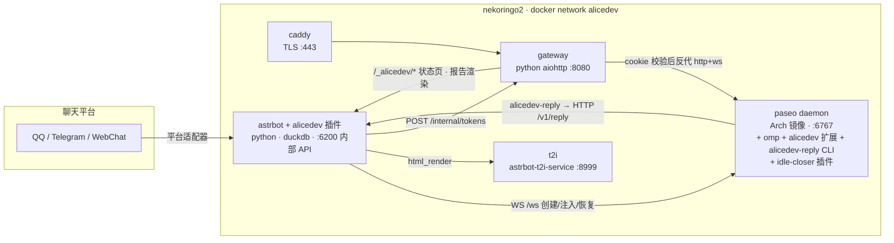
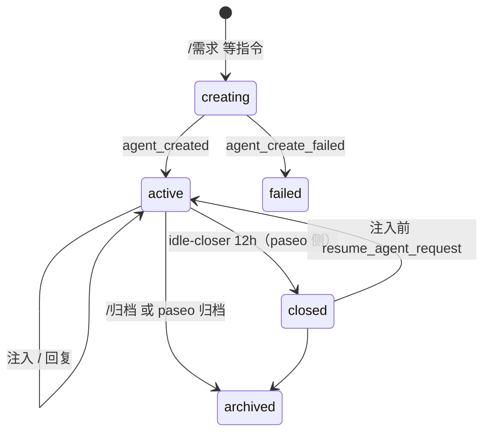

# alicedev 架构与契约

> 权威设计文档。所有切片按本文件的契约实现；契约变更必须先改本文件。事实依据见 `docs/research/*.md`（paseo / omp / AstrBot / 基础设施 / QQ 协议端调查）。

## 0. 一句话

AstrBot 插件把群聊指令变成 paseo 会话，paseo 里的 omp 通过反向 CLI 把回复送回群；网关用一次性 token 把 paseo 的工作区面板和调查报告安全地分享出去。

## 1. 进程与容器（nekoringo2，docker compose）



| 进程 | 语言 | 职责 | 写哪个 DuckDB |
|---|---|---|---|
| `astrbot` + 插件 `bot/` | Python 3.11 | 指令、模板、需求/收藏、会话映射、渲染、内部 API、GitHub 解读 | `data/plugin_data/alicedev/alicedev.duckdb`（**唯一写者**） |
| `gateway/` | Python 3.11 | TLS 后的一次性 token、cookie、反代 paseo、报告 md 渲染、状态页 | 无（token 内存表 + 无状态 HMAC cookie） |
| `paseo` | TS（fork `paseo-alicedev`） | agent 运行时；fork 新增 `close_agent_request`、embed 模式 | 无 |
| `harness/omp-extension` | TS | marker 剥离、`chat_reply` 工具、未回复提醒 | 无（用 `pi.appendEntry` 记录） |
| `harness/reply-cli` | TS（node 单文件） | `alicedev-reply`：HTTP POST 到 bot `/v1/reply` | 无 |
| `paseo-plugins/idle-closer` | TS | 12h 无互动 → `close_agent_request` | 无 |
| `t2i` | 官方镜像 | HTML→PNG | 无 |
| `caddy` | 官方镜像 | ACME TLS，转发 gateway | 无 |

**DuckDB 单写者原则**：只有 AstrBot 插件进程打开 `alicedev.duckdb`。其他进程通过 bot 内部 HTTP API 读写。

## 2. 标识符

| 名称 | 形式 | 说明 |
|---|---|---|
| `chat_key` | AstrBot `event.unified_msg_origin`，即 `<platform_id>:<GroupMessage\|FriendMessage>:<chat_id>` | 群/私聊唯一键，QQ/TG/WebChat 通用 |
| `user_key` | `<platform_id>:<sender_id>` | 用户唯一键 |
| `session_ref` | `s_` + 10 位 base32 | alicedev 会话 id，用户可见（`/继续 s_xxx`） |
| `msg_ref` | `m_` + 10 位 base32 | 注入 paseo 的每条消息的 id（不是平台 message_id；平台 id 存表） |
| paseo `agentId` / `workspaceId` / `persistence handle` | paseo 原生 | 存于 sessions 表 |
| `report_id` | `r_` + 10 位 base32 | 调查报告公开链接 id |
| `token` | 32 字节 urlsafe base64 | 一次性入口 token |

## 3. 契约 A：Prompt 模板（`templates/prompts/*.md`）

frontmatter + Jinja2 正文。目录即注册表，加文件 = 加指令。

```yaml
---
name: requirement                # 唯一
trigger:
  command: 需求                   # /需求 <text>；或
  # link: github_issue | github_pr  # 消息仅含 GitHub issue/PR 链接时触发
aliases: [req]
description: 记录群友需求并交给 AI 分析
harness: omp                     # omp | pi（paseo provider id 映射见 §7）
model: anthropic/claude-sonnet-4-5   # 直接传 paseo create_agent_request.config.model
effort: high                     # off|minimal|low|medium|high|xhigh|max → thinkingOptionId
cwd: /workspace/openalice        # paseo 会话 cwd；默认 /workspace/alicedev
system: |                        # 可选，追加到 paseo config.systemPrompt
  你是 OpenAlice 社区的需求分析助手。
record: requirement              # 可选：requirement → 同时写 requirements 表
reply:                           # 允许的回复形态；bot 侧强制校验
  kinds: [text, image_template, sticker, file]
  image_templates: [requirement_summary, generic_card]
  text_templates: []
  stickers: [ok, thinking, confused]
  max_text_chars: 600            # 超过则拒绝 text，要求用 image_template
---
群 {{ chat.name }} 的 {{ sender.name }} 提出需求：

{{ text }}

引用的消息（{{ quoted.sender }}）：
{{ quoted.text }}
相关 GitHub {{ github.kind }} #{{ github.number }}：{{ github.title }}
{{ github.body }}
```

模板变量：`text`、`sender{id,name}`、`chat{key,name}`、`quoted{sender,text,images[]}`、`images[]`、`github{kind,owner,repo,number,title,body,labels[],state,url}`、`session_ref`。

渲染后的正文作为 `initialPrompt`。bot 在正文**末尾**追加固定的「回复方式」段落（由 `reply` 配置生成，告诉 AI 可用的 kinds/templates/stickers 与 `chat_reply` 用法），并在正文**首行**加 marker（§5）。

## 4. 契约 B：bot ↔ paseo（WebSocket，`ws://paseo:6767/ws`）

bot 用 Python 实现 paseo 协议 v1 客户端（`bot/alicedev/paseo/client.py`），仅用以下消息：

| 操作 | paseo 消息 | 备注 |
|---|---|---|
| 握手 | `hello{clientId:"alicedev-bot", clientType:"cli", protocolVersion:1}` | 升级时带 `Authorization: Bearer $PASEO_PASSWORD` + 子协议 `paseo.bearer.<pw>` |
| 建会话 | `create_agent_request{config:{provider, model, thinkingOptionId, systemPrompt, cwd}, title, initialPrompt, labels:{alicedev:session_ref}}` | 不与 `idempotencyKey` 同用；成功 `status:agent_created` 取 `agentId/workspaceId/persistence` |
| 注入 | `send_agent_message_request{agentId, text, messageId: msg_ref, activeTurnBehavior:"followUp"}` | 响应 `accepted`；bot 串行化同一会话的注入 |
| 状态 | `fetch_agents_request` / `agent_update` | 取 `status`（idle/running/closed/error）、`persistence` |
| 恢复 | `resume_agent_request{handle}` | `closed` 时先恢复再注入 |
| 关闭 | `close_agent_request{agentId}`（**fork 新增**） | 保留记录，释放运行时；`closed` 可恢复 |

会话状态机（bot 视角，存 sessions.status）：



`last_activity_at`（bot 侧）= 最近一次注入或收到 `chat_reply` 的时间；paseo 侧 idle-closer 用自己观测到的 `agent.turn_ended` 时间，两者不共享存储。

## 5. 契约 C：注入文本 marker 与 harness 扩展

注入 paseo 的 `text` 首行固定为：

```
[alicedev session=s_xxxxxxxxxx msg=m_yyyyyyyyyy]
<正文>
```

omp 扩展（`harness/omp-extension`）：

1. `pi.on("input")`：若首行匹配 marker → 记录 `pending[msg]={session,msg,originalText}`，`pi.appendEntry("alicedev.pending", ...)`，返回 `transform` 去掉首行。模型看不到 marker。
2. `pi.registerTool("chat_reply")`：参数 = §6 `ReplyPayload` + 可选 `msg`（缺省取最新 pending）。执行 `alicedev-reply --session <s> --msg <m> --json '<payload>'`；退出码 0 且 stdout `{"delivered":true}` 才标记消费（`appendEntry("alicedev.consumed")`）；否则把错误原样返回给模型。
3. `pi.on("session_stop")`：存在未消费 pending 且该 msg 尚未提醒 → 返回 `{continue:true, additionalContext:"你尚未用 chat_reply 回复用户消息（msg=…）。原消息：…"}`，每条 msg 只提醒一次。
4. `session_start` 时从 `getBranch()` 的 pending/consumed 条目重建状态。
5. harness 无关核心（marker 解析、pending 状态机、payload 校验）放 `harness/core/`，omp 适配只做事件绑定；pi 适配在其 `input`/`agent_settled` 事件可验证后再加，**不留 stub**。

## 6. 契约 D：bot 内部 HTTP API（`http://astrbot:6200`，头 `X-Alicedev-Token: $ALICEDEV_INTERNAL_TOKEN`）

```ts
type ReplyPayload =
  | { kind: "text"; text: string; sticker?: string }
  | { kind: "text_template"; template: string; fields: Record<string, string>; sticker?: string }
  | { kind: "image_template"; template: string; fields: Record<string, unknown>; sticker?: string }
  | { kind: "sticker"; sticker: string }
  | { kind: "file"; path: string; caption?: string };   // path 必须在 REPORTS_ROOT 下

POST /v1/reply   { session: string; msg?: string; reply: ReplyPayload }
  → 200 { delivered: true; platform_message_ids: string[]; report_url?: string }
  → 400 { error: "invalid_payload" | "kind_not_allowed" | "template_unknown" | "path_outside_root" | "text_too_long", detail }
  → 404 { error: "session_unknown" }
  → 502 { error: "platform_send_failed", detail }
GET  /v1/sessions/{session}  → { session, chat_key, template, status, reply_spec }
GET  /v1/reports/{report_id} → { report_id, path, created_at }            // gateway 用
GET  /v1/status → { ok, uptime_s, platforms: [...], commands: [{name, description}], templates: [{name, trigger, description}], sessions: {active, closed} }
```

语义：`delivered:true` 表示平台适配器 `send` 返回成功。`kind:"file"` 且 `.md` → bot 登记 `report_id`，回群一条 `report_url`（`https://<host>/_alicedev/r/<report_id>/`）；非 `.md` → 以文件组件发送。`image_template` → Jinja HTML（`templates/cards/<template>.html`）→ `html_render` → 图片。`sticker` → `templates/stickers/<name>.(png|gif|webp)`。

## 7. 契约 E：harness → paseo provider 映射

| 模板 `harness` | paseo `config.provider` | 备注 |
|---|---|---|
| `omp` | `omp`（daemon 配置里启用；默认关闭） | `omp --mode rpc-ui`；扩展通过 `~/.omp/agent/extensions/alicedev` 符号链接（容器 entrypoint 播种）加载；若 rpc-ui 下 `input` 事件不触发，改为 paseo custom provider `omp-alicedev`（`extends: omp`, 追加 `-e /opt/alicedev/omp-extension`）——由 spike 决定并回写本表 |
| `pi` | `pi` | 仅当 pi 适配实现后开放 |

`effort` → `thinkingOptionId`（同名）。`model` 原样传入。

## 8. 契约 F：网关（`gateway/`）

- **入口**：`GET /t/<token>` → 原子消费（单进程 asyncio，dict pop）→ 设 cookie `alicedev_s=<base64(payload)>.<hmac>`，payload=`{iat, sub: user_key}`，`Secure; HttpOnly; SameSite=Lax; Max-Age=2592000` → 302 到 `/_alicedev/?go=<target>`。
- **token 表**：内存 `{token: {target, user_key, expires_at}}`；6h 到期后台清理；重启即失效（文档化）。`POST /internal/tokens {target, user_key, ttl_s?}` → `{token, url}`，仅 docker 网络 + `X-Alicedev-Token`。
- **cookie 校验**：除 `/t/*`、`/_alicedev/r/*`、`/_alicedev/static/*`、`/_alicedev/health` 外全部要求合法 cookie；失败 → 403 静态页。
- **`/_alicedev/`**：状态页（服务端渲染，取 bot `/v1/status`），含 `go` 链接按钮。
- **`/_alicedev/r/<report_id>/[<sub>]`**：向 bot 取 `path`（缓存 60s），`realpath` 必须在 `REPORTS_ROOT` 内，禁止 `..`、符号链接逃逸；`.md` → markdown-it-py（table、strikethrough、footnote、tasklists、deflist、front_matter、texmath）+ pygments 代码高亮 + 客户端 mermaid（静态资源自带，不走 CDN）；其他扩展名按 MIME 直出（仅白名单：md, png, jpg, gif, webp, svg, txt, json, csv, pdf）。
- **其余路径** → 反代 `http://paseo:6767`（HTTP + WebSocket 双向泵），上游请求注入 `Authorization: Bearer $PASEO_PASSWORD` 与子协议 `paseo.bearer.<pw>`；浏览器侧不需要密码。
- 不记录 token/cookie 到日志；`Referrer-Policy: no-referrer`。

## 9. 契约 G：paseo fork（`mouriya-s-lab/paseo-alicedev`，基于 `mouriya-s-lab/paseo` main）

1. **`close_agent_request`**：protocol schema + server handler（调用现有内部关闭运行时路径，保留记录、status→`closed`）+ client `agents.close(agentId)` + CLI `paseo agent close`。放 `packages/*/src/fork-features/close-agent/`，trunk 接线记入 `fork-features/trunk-patches.md`。
2. **embed 模式**：URL 带 `?embed=1` → 不渲染左侧 `LeftSidebar`/`SidebarChrome`，隐藏主面板内的导航逃逸（历史、项目设置、host 列表、新建工作区等，清单见 `docs/research/paseo-app-embed.md` §4）；`embed` 标志在 agent→workspace 重定向中保留；首次加载 host 注册竞态修复。`packages/app/src/fork-features/embed/`。
3. **Arch 镜像**：`docker/arch/Dockerfile`，保持现有契约（uid/gid 1000、`/home/paseo`、`/workspace`、`PASEO_LISTEN=0.0.0.0:6767`、`/api/health`、tini+gosu 等价物），Arch builder + runtime 同一 Node 大版本；安装 `omp`、`node`、`git`、`gh`；`/opt/alicedev/{omp-extension,reply-cli,idle-closer}` 由 alicedev 仓库构建产物 COPY 进来（compose build context 传入）。
4. 每项都是独立 PR，对应 issue。

## 10. 契约 H：指令集（bot）

| 指令 | 权限 | 行为 |
|---|---|---|
| `/<模板 command> <text>` | 群白名单内所有人 | 渲染模板 → 建会话 → 注入 initialPrompt；若 `record: requirement` 写需求表；回「已创建 s_xxx」 |
| `/继续 <s_ref> <text>` 或 引用 bot 消息 + 文本 | 同上 | 注入该会话（closed 则 resume） |
| `/收藏`（必须引用一条消息） | 同上 | 写 favorites（原作者、文本、图片落盘、收藏人）；回「已收藏 #n」 |
| `/收藏夹 [page]` | 同上 | 卡片图（每页 10 条，含图片缩略） |
| `/需求列表 [page]` | 同上 | 卡片图（每页 10 条，状态、会话 ref） |
| `/链接 [s_ref] [@A @B ...]` | 管理员 | 每个 @ 用户一个 token；无 @ 则给发起人；`target=/h/<serverId>/workspace/<ws>?open=agent%3A<agent>&embed=1`；逐条 `[At, Plain(url)]` 发送 |
| `/解读 <github url \| #123>` 或 消息仅含 issue/PR 链接 | 所有人 | 预取 issue/PR（REST，可选 `GITHUB_TOKEN`）→ 模板 `github-issue`/`github-pr` |
| `/归档 <s_ref>` | 管理员 | paseo 归档 + sessions.status=archived |
| `/alicedev` | 所有人 | 文本帮助：命令与模板列表 |

指令分发：单个 `@filter.regex(r"^[/／]")` 入口 + `CommandRegistry`（name/aliases/permission/handler/help），模板指令在启动时由 `TemplateRegistry` 注册。不使用 AstrBot 静态 `@filter.command`，避免与模板动态注册冲突。

## 11. DuckDB schema（`bot/alicedev/store/schema.sql`，migrations 表记版本）

```sql
sessions(session_ref PK, chat_key, template, agent_id, workspace_id, server_id, persistence_handle, status, created_by, created_at, last_activity_at)
messages(msg_ref PK, session_ref, chat_key, platform_message_id, sender_key, text, direction ENUM('in','out'), replied_at, created_at)
requirements(id PK autoinc, chat_key, session_ref, author_key, author_name, text, images JSON, status, created_at)
favorites(id PK autoinc, chat_key, saver_key, saver_name, author_key, author_name, text, images JSON, platform_message_id, created_at)
reports(report_id PK, session_ref, path, created_at)
tokens_issued(token_id PK, session_ref, user_key, issued_by, target, issued_at, expires_at)   -- 审计，不是校验来源
outbound(platform_message_id PK, chat_key, session_ref, created_at)                            -- 引用回复 → 会话
```

## 12. 安全

- 反向 API / token 注册：docker 网络 + 共享 header 密钥；不暴露主机端口。
- 群文本进入 prompt 前做长度上限与控制字符清理；marker 只由 bot 生成，扩展只认首行。
- 报告路径：realpath 白名单；`file` kind 不接受符号链接逃逸。
- token 只在 URL 出现一次；cookie 无状态、可撤销方式 = 换 `GATEWAY_SECRET`。
- paseo 密码只在 docker 网络内流转；对外只有 gateway/caddy 端口。
- 分享页只暴露工作区面板；embed 隐藏所有项目/主机级操作。

## 13. 部署（`deploy/`）

- `docker-compose.yml`：caddy、gateway、astrbot、t2i、paseo；`.env.example` 列出 `TELEGRAM_BOT_TOKEN`、`PASEO_PASSWORD`、`ALICEDEV_INTERNAL_TOKEN`、`GATEWAY_SECRET`、`ASTRBOT_DASHBOARD_INITIAL_PASSWORD`、`ALICEDEV_HOST`。
- paseo 镜像在 nekoringo2 上用 compose `build` 从 `paseo-alicedev` 检出构建（context 含 alicedev 的 harness 构建产物）。
- AstrBot 插件 bind mount `./bot` → `/AstrBot/data/plugins/alicedev`；`cmd_config.json` 预置 telegram + webchat + `t2i_endpoint`。
- DNS：`alicedev.237575.xyz` A → 160.191.41.242，经 Cloudflare API（token 来自 pve-vctcn SOPS）；nekoringo2 不归 IaC 管，记录于 HANDOFF。
- QQ 协议端：见 `docs/research/qq-protocol.md`；推荐 QQ 官方 Bot API（`qq_official`），个人号需求时 NapCat Docker 作 fallback；SR-IOV iGPU 不作为稳定性手段。

## 14. 仓库布局（`mouriya-s-lab/alicedev`）

```
bot/                     AstrBot 插件（metadata.yaml, main.py, _conf_schema.json, requirements.txt, alicedev/…）
  alicedev/commands/     CommandRegistry + handlers
  alicedev/templates/    frontmatter loader, Jinja 渲染, reply_spec
  alicedev/store/        duckdb 连接、schema、repository
  alicedev/paseo/        WS 客户端
  alicedev/render/       卡片渲染（html_render 封装、分页）
  alicedev/api/          内部 HTTP API
  alicedev/github/       链接解析与预取
templates/prompts/       *.md 模板
templates/cards/         *.html 图片模板
templates/stickers/      表情包 + index.json
harness/core/            marker/pending/payload（TS，无 harness 依赖）
harness/omp-extension/   omp 适配
harness/reply-cli/       alicedev-reply
paseo-plugins/idle-closer/
gateway/                 aiohttp 服务
deploy/                  compose, Caddyfile, astrbot 配置模板, paseo 构建脚本
docs/research/           调查事实（从 local:// 复制）
docs/runbook.md          部署、DNS、QQ 接入、故障处理
```

## 15. 交付顺序

1. **Spike（真实边界）**：本机 OrbStack 跑 AstrBot(webchat)+t2i，本机原生跑 paseo daemon（fork 检出）+ omp；实现 `bot/alicedev/paseo/client.py`、`harness/*`、`bot/alicedev/api`、最小 `/需求`，证明 webchat → paseo → omp 扩展 → `alicedev-reply` → webchat 回复全链路。产出回写 §7。
2. **并行切片**（契约已定，不等 spike）：gateway；paseo fork 三项；DuckDB store + 需求/收藏/列表卡片；模板 loader + GitHub 预取；idle-closer；Arch 镜像；compose/runbook。
3. **集成**：nekoringo2 部署，DNS/TLS，WebChat 端到端，`/链接` 分享页浏览器验证，报告 md 渲染验证。
