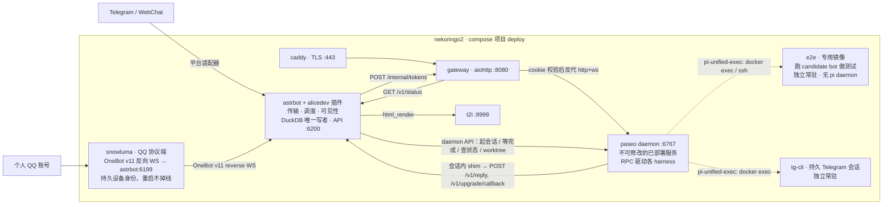
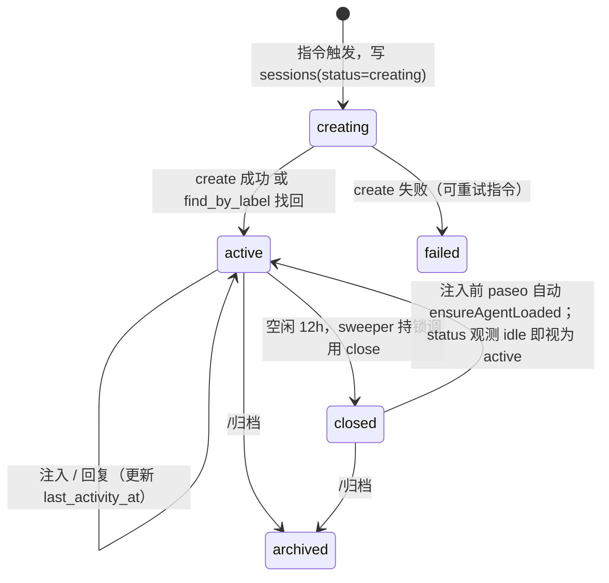
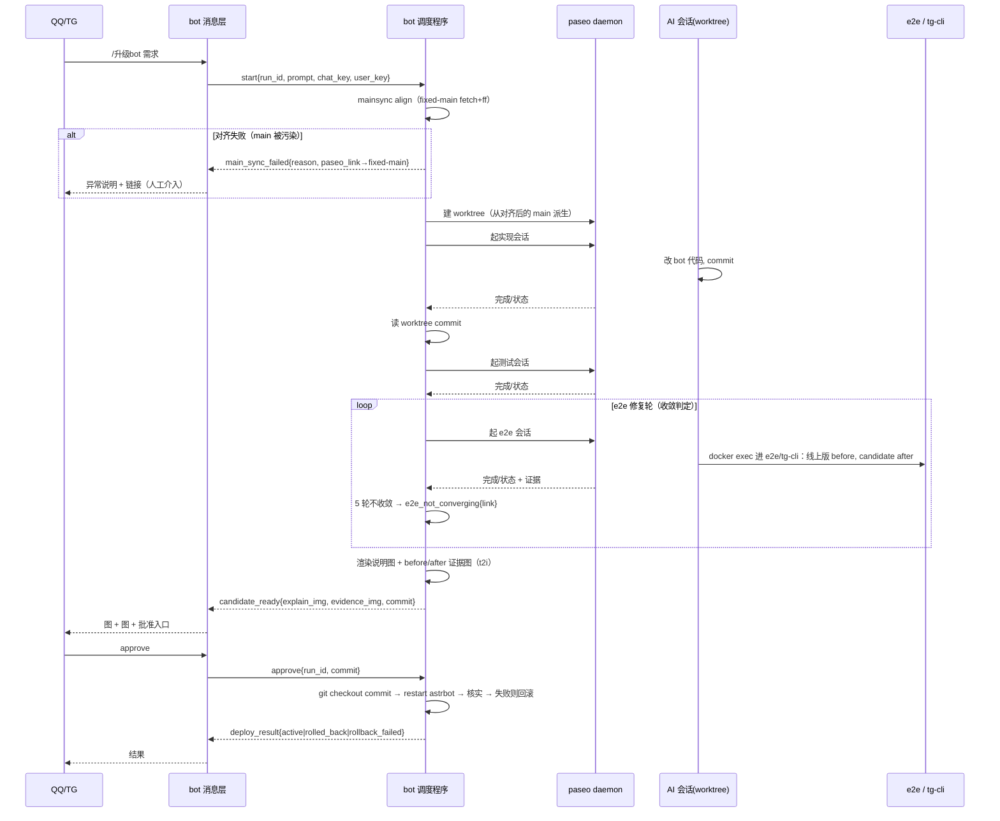

# alicedev 架构与契约（v3）

> 权威设计文档。所有切片按本文件的契约实现；**契约变更必须先改本文件，再写代码**。事实依据见 `docs/research/*.md`。v3 = v2（已部署的普通会话链路）+ §15 `/升级bot` 闭环（用户已定稿、尚未落地）。v2 中被 v3 推翻的表述已直接替换，不保留对照。

## 0. 一句话

AstrBot 插件把群聊指令变成 paseo 会话，paseo 里的 harness 通过 `alicedev-reply` 把回复送回群；网关用一次性 token 把 paseo 的工作区面板分享出去，并公开渲染调查报告。`/升级bot` 让 bot 侧的调度程序驱动 paseo 里的 AI 迭代 bot 自身，产出图片证据，经人批准后以 git + 重启 astrbot 自动上线。

**四条不变量（违背即错）**
1. **monorepo**：alicedev 的全部代码（bot、调度、shim、e2e 基建、部署）只在本仓库。paseo fork 仅承载 embed 模式与 Arch 镜像（§9），不放任何 alicedev 业务逻辑。
2. **paseo daemon 是不可修改的已部署基础设施**：被动响应 API（起会话 / 等完成 / 查状态 / 建或归档 worktree），从不主动发意图、从不推进流程。daemon 用 RPC 与各 harness（omp / pi / claude / codex…）通信并自行整理会话产出与状态；bot **只读 daemon 整理好的结果**，绝不直接驱动 harness、绝不要求模型按 schema 吐 JSON。
3. **bot 侧三个独立职责，互不混淆**：**传输**（平台适配器与 QQ/TG 收发文字、图片、链接）、**调度**（驱动 daemon 一步步推进多会话流程的程序，在 bot 侧）、**可见性**（调度内部状态不暴露给 QQ，只有边界事件进入聊天面）。
4. **IaC 只声明与 provision 宿主文件，与运行时彻底解耦**：`nekoringo-iac/apps/alicedev`（OpenTofu）只把声明的宿主文件从一个 committed alicedev revision 落到 `/srv/alicedev`；`tofu apply` 成功 = 文件落地，**绝不**跑 `docker compose`、判容器健康、验 QQ 在线、记 ownership —— 服务不健康不靠重跑 apply 修。运行时 bring-up（`compose up` / `deployctl` 的 checkout+restart）与健康 / QQ / e2e 监控是**另一层 owner**；`bot/` 由 `deployctl` 拥有、不进 IaC 托管集。详见 §12。

## 1. 进程与容器（nekoringo2，docker compose，网络 `alicedev`）



常驻容器 8 个：`caddy`、`gateway`、`astrbot`、`snowluma`（替换 NapCat）、`paseo`、`t2i`、`e2e`、`tg-cli`；一次性 init 2 个：`astrbot-init`、`reports-init`。`e2e` 与 `tg-cli` **永不随任何其他服务下线**。

| 进程 | 语言 | 职责 |
|---|---|---|
| `astrbot` + 插件 `bot/` | Python 3.11 | **传输**：指令、模板、需求/收藏、会话状态机、12h 空闲关闭、渲染、内部 API、GitHub 预取、报告发布。**调度**：`/升级bot` 调度程序（§15）。**可见性**：只把边界事件送进聊天 |
| `snowluma` | — | 个人 QQ 的生产协议端与 OneBot v11 reverse-WS 客户端，替换 NapCat（§12）。登录态与设备身份在命名卷 |
| `gateway/` | Python 3.11 | 一次性 token → cookie、反代 paseo（含 WS 子协议注入）、报告 md 渲染、状态页 |
| `paseo`（fork `paseo-alicedev`） | TS | **不可修改的已部署服务**。agent 运行时，RPC 驱动 harness；fork 只做 embed 模式 + Arch 镜像，**不含任何 alicedev 业务逻辑** |
| `harness/omp-extension` | TS | 普通会话链路：`/chat_ingress` 命令、`chat_reply` 工具、`session_stop` 提醒 |
| `harness/reply-cli` | TS（node 单文件，零依赖） | `alicedev-reply`：POST `/v1/reply`，带重试 |
| `e2e` | 专用镜像（astrbot + t2i + webchat） | `/升级bot` 测试场：以线上版本与 candidate 分别跑同一冻结场景；无生产凭据；内部不跑 pi |
| `tg-cli` | kabi-tg-cli + Telethon | `/升级bot` 真实消息面：持久 Telegram 会话，发消息 / 取消息 / 下载图片 |
| `t2i`、`caddy` | 官方镜像 | HTML→PNG；ACME TLS |

**单写者**：只有 AstrBot 插件进程打开 `alicedev.duckdb`；所有存储变更经 `Store` 的单个 `asyncio.Lock`。其他进程通过 bot 内部 HTTP API。**没有** paseo 侧 sidecar，没有 TS bridge 服务。

**内部 API 传输**：docker 网络 HTTP + 头 `X-Alicedev-Token`，不映射主机端口。

**QQ 生产链路**：QQ 协议端加入 `internal`（反向 WS）和 `edge`（QQ 登录/消息出站）网络；AstrBot 在容器内监听 `0.0.0.0:6199`，宿主机不发布 6199。协议端管理面板只绑定宿主机 netbird 接口（`PANEL_BIND_IP`），mesh 内直连，公网不可达。QQ 登录密码只在面板输入，不进入 Compose、`.env` 或仓库；设备身份由命名卷持久化。

**AI 工作目录与 project（paseo 容器 `/workspace` 卷）**

| project | 工作目录 | 用途 |
|---|---|---|
| 现有：OpenAlice | `/workspace/openalice` | 普通会话（`/需求`、`/帮我调查`、`/解读`…）给用户干活 |
| 新增：迭代 bot | fixed-main `/workspace/alicedev`（**只做 main 对 remote 的 fetch+ff 对齐，永不开 AI、永不写**）+ 每条 `/升级bot` 一个从它派生的 git worktree | `/升级bot` 的全部 AI 会话（实现 / 测试 / e2e，各自 tab）只在该需求的 worktree 里工作 |

现状：`/workspace/alicedev` 为空目录，迭代 bot project 与 fixed-main **尚未建立**，是 §15 的第一个前置条件。

## 2. 标识符

| 名称 | 形式 | 说明 |
|---|---|---|
| `chat_key` | AstrBot `event.unified_msg_origin` | 群/私聊唯一键 |
| `user_key` | `<platform_id>:<sender_id>` | 用户唯一键 |
| `session_ref` | `s_` + 10 位 base32 | alicedev 会话 id，用户可见 |
| `msg_ref` | `m_` + 10 位 base32 | 每条注入消息 id；入站唯一键 `(chat_key, platform_message_id)` 防平台重投 |
| `reply_id` | 扩展生成 UUIDv4，每次工具调用一个，重试复用 | 回复幂等键 |
| `report_id` | `r_` + 26 位 base32（128 bit） | 报告公开 URL 的 bearer 能力 |
| `token` | 32 字节 urlsafe base64 | 一次性入口 |

## 3. 契约 A：Prompt 模板（`templates/prompts/*.md`）

frontmatter + Jinja2 正文。目录即注册表。

```yaml
---
name: requirement
trigger:
  command: 需求            # 或 link: github_issue | github_pr
aliases: [req]
description: 记录群友需求并交给 AI 分析
harness: omp              # 目前仅 omp；pi 待其适配落地后开放
model: anthropic/claude-sonnet-4-5   # 格式由 §7 映射表规定
effort: high              # off|minimal|low|medium|high|xhigh|max
cwd: /workspace/openalice # 默认 /workspace/alicedev
record: requirement       # 可选：同时写 requirements 表
reply:
  kinds: [text, image_template, sticker, file]
  image_templates: [requirement_summary, generic_card]
  text_templates: []
  stickers: [ok, thinking, confused]
  max_text_chars: 600
---
（Jinja2 正文 = 首轮 prompt。system 段也写在这里：paseo MCP create 没有 systemPrompt 字段，且 omp 的 system prompt 由用户自管。）
```

变量：`text`、`sender{id,name}`、`chat{key,name}`、`quoted{sender,text,images[]}`、`images[]`、`github{kind,owner,repo,number,title,body,labels[],state,url}`、`session_ref`。

bot 在渲染正文末尾追加「回复方式」段（由 `reply` 生成：可用 kinds/templates/stickers、`chat_reply` 用法、长内容必须走 image_template）。

## 4. 契约 B：bot → paseo 控制面

Python 内实现 `PaseoControl` 接口（`bot/alicedev/paseo/`），操作级契约固定，传输由 spike 决定：

| 操作 | 首选：`POST /mcp/agents`（MCP JSON-RPC `tools/call`，`Authorization: Bearer $PASEO_PASSWORD`） | 备选：WS `/ws` 协议 v1 |
|---|---|---|
| `create(session_ref, provider, model, thinking, cwd, title, initial_prompt)` | `create_agent`（**spike 修正：MCP 要求 `initialPrompt`+`provider` 必填**——ingress 命令即首轮 initialPrompt；`provider=<provider>/<model>`、`labels.alicedev=session_ref`、`settings.thinkingOptionId=<effort>`、`workspace.kind=create`、`relationship=detached`、`background=true`） | `create_agent_request{idempotencyKey: session_ref, labels}` |
| `find_by_label(session_ref)` | `list_agents` 过滤 label | `fetch_agents_request` |
| `send(agent_id, text)` | `send_agent_prompt` | `send_agent_message_request{messageId: msg_ref}` |
| `status(agent_id)` → idle/running/permission/closed/error | `get_agent_status` | `fetch_agents_request` |
| `close(agent_id)`（保留记录，可恢复） | `kill_agent`（= 内部 `closeAgent`，lifecycle→closed） | fork 新增 `close_agent_request`（仅在 MCP 路径不可用时） |
| `archive(agent_id)` | `archive_agent` | `close_items_request` |

spike 验收（已完成，2026-09-18，见 `docs/research/spike-results.md`）：MCP `POST /mcp/agents` 裸 `tools/call` 可用，**无需 `initialize` 握手、无需 daemon 自身 caller 上下文**；`create_agent` 的 `provider`+`initialPrompt` 为必填，故 ingress 命令改由 initialPrompt 承载（不再单独 send 首轮），omp 扩展仍在模型前拦截、msg id 不入上下文（已实测）。`kill_agent` = 可恢复 close（status→closed，记录保留）；对 closed agent `send_agent_prompt` 触发 paseo 自动 ensureAgentLoaded（status→running）实现 closed→active 自动恢复（已实测）。WS 备选与 fork `close_agent_request`（§9 第 3 项）无需实现。

**会话状态机（bot 是唯一执行者；每个 session_ref 一把 `asyncio.Lock` 作为租约）**



- 创建：写 `sessions(creating)` → `create`（ingress 命令作为 initialPrompt，omp 扩展在模型前拦截，msg id 不入模型上下文）→ 响应丢失时 `find_by_label`（label `alicedev=session_ref`）找回 → 写 `agent_id` → 转 `active`。
- 注入：持锁 → `status`；`running/permission` 则每 2s 轮询直到 idle（上限 10 min，超时回群「AI 仍在处理，稍后再试」）→ `send` → 写 `messages` → 更新 `last_activity_at`。同一会话严格串行；不同会话并行。
- 关闭：sweeper 每 10 min 扫 `status=active AND last_activity_at < now-12h`；持锁 → `status` 非 running/permission → `close` → `status=closed`。幂等。时钟只有一个：`sessions.last_activity_at`（注入时间与 `/v1/reply` 时间的较大者），随 DuckDB 持久化，重启不丢。
- 空闲关闭放在 bot 而非 paseo 侧车：只有 bot 同时看到注入与回复两个方向，且 paseo 无原生 idle 事件、公开 API 无 close 消息（`docs/research/paseo-api.md` §3）。

## 5. 契约 C：ingress 命令与 omp 扩展

omp 在 rpc/rpc-ui 下**不触发** `input` 事件（`oh-my-pi/.../types.ts:908`，`input-controller.ts:766`），但注册的扩展命令在模型之前被处理（`agent-session.ts:6126-6147`）。因此注入文本固定为：

```
/chat_ingress {"session":"s_…","msg":"m_…","text":"<渲染后的 prompt>"}
```

（单行 JSON；`text` 内换行按 JSON 转义。）

扩展 `harness/omp-extension`（核心逻辑在 `harness/core`，无 harness 依赖）：

1. `pi.registerCommand("chat_ingress")`：解析 JSON → `pending.push({session,msg,text})` → `pi.appendEntry("alicedev.pending", {session,msg})` → `pi.sendUserMessage(text)`。模型只看到 `text`。
2. `pi.registerTool("chat_reply")`：参数 = `ReplyPayload`（§6）。执行：生成/复用 `reply_id`；`pi.exec("alicedev-reply", ["--session", s, "--reply-id", id, "--msgs", "m1,m2", "--json", payload])`；退出码 0 且 stdout `{"status":"sent"|"replayed"}` → 把**当前全部 pending** 标记 consumed（`appendEntry("alicedev.consumed", {msgs, reply_id})`），返回成功；非 0 → 把 stderr 原样返回给模型，pending 不变。一条回复覆盖此前收到的所有消息（聊天语义）。
3. `pi.on("session_stop")`：若 `event.signal.aborted` 或 ctx 正在关闭 → 不干预。否则若 pending 非空且尚未对当前 pending 集合提醒过（`appendEntry("alicedev.reminded", {msgs})` 持久化）→ 返回 `{continue:true, additionalContext}`，内容为固定模板 + JSON 编码的原文（不拼接裸文本）。同一 pending 集合只提醒一次。
4. `session_start`：扫 `getBranch()` 重建 pending/consumed/reminded。
5. 加载方式：paseo custom provider `omp-alicedev`：`{extends:"omp", command:["omp","-e","/opt/alicedev/omp-extension"]}`（replace 模式，argv[0] 必须是 omp；`provider-registry.ts:833-862`，`omp/runtime.ts:83-88`）。不用 HOME 符号链接、不用 cwd 发现。

## 6. 契约 D：bot 内部 HTTP API（`http://astrbot:6200`，头 `X-Alicedev-Token`）

```ts
type ReplyPayload =
  | { kind: "text"; text: string; sticker?: string }
  | { kind: "text_template"; template: string; fields: Record<string, string>; sticker?: string }
  | { kind: "image_template"; template: string; fields: Record<string, unknown>; sticker?: string }
  | { kind: "sticker"; sticker: string }
  | { kind: "file"; path: string; caption?: string };   // path 在 REPORTS_ROOT 下

POST /v1/reply { session; reply_id; msgs: string[]; reply: ReplyPayload }
  → 200 { status: "sent" | "replayed"; platform_message_ids: string[]; report_url?: string }
  → 400 { error: invalid_payload | kind_not_allowed | template_unknown | path_outside_root | file_not_regular }
  → 404 { error: session_unknown }
  → 409 { error: reply_id_conflict }          // 同 reply_id 不同 payload 摘要
  → 502 { error: platform_send_failed; detail }
GET  /v1/sessions/{session} → { session, chat_key, template, status, reply_spec }
GET  /v1/status → { ok, generation, uptime_s, platforms[], commands[], templates[], sessions:{active,closed} }
GET  /v1/health → 200 { generation }         // reply-cli 重连探测
```

**回复语义（at-most-once + 幂等重放）**：`reply_deliveries(reply_id PK, session_ref, msgs, payload_sha256, state claimed|sent|failed, platform_message_ids, created_at)`。处理：持 Store 锁 → 若 `reply_id` 已存在：摘要相同 → 重放先前结果（`replayed`）；不同 → 409。否则写 `claimed` → 释放锁 → 平台发送 → 写 `sent`/`failed`。`sent` = 适配器 `send` 返回成功，不承诺对端已读。发送后进程崩溃 → 状态停留 `claimed`，重试返回 409？否：`claimed` 超过 60s 视为 `unknown` 并允许重试（可能重复，文档化）。

**长内容不变量**：`text` 超过 `max_text_chars` → bot 自动改走 `generic_card` 图片模板，不拒绝。

**`kind:"file"` 发布**：bot 校验 `os.path.realpath(path)` 以 `REPORTS_ROOT/` 为前缀、`lstat` 为常规文件、路径各段无符号链接；生成 `report_id`；原子复制到 `REPORTS_ROOT/_published/<report_id>/<basename>`（临时文件 + rename）；写 `reports`；`.md` → 回群 `https://<host>/_alicedev/r/<report_id>/<basename>`；其他扩展名 → 以文件组件发送。

**插件生命周期**：`initialize()`：打开 Store（一次）→ 启动 aiohttp `TCPSite`（`reuse_port`）→ 启动 sweeper/outbox 任务；`generation` 自增。`terminate()`：标记 draining（`/v1/*` 返回 503）→ 等待在途请求 ≤10s → 取消并等待任务 → 关站 → 关 Store。reply-cli 遇 503/连接拒绝按 1,2,4,8s 重试至 30s。

## 7. 契约 E：harness → paseo provider 与参数映射

| 模板 `harness` | paseo provider id | `model` 传递 | `effort` 传递 |
|---|---|---|---|
| `omp` | `omp-alicedev`（daemon 配置 custom provider，见 §5.5；基础 `omp` provider 需启用） | **spike 确认**：paseo catalog `provider/model`（如 `anthropic/claude-fable-5-1`）；create_agent 的 `provider` 字段传 `omp-alicedev/<provider>/<model>` | `settings.thinkingOptionId`（omp `--thinking` 同名级别，如 `high`） |

bot 持久化解析后的实际值到 `sessions(provider, model, thinking)`。

## 8. 契约 F：网关

**威胁模型（明确决定）**：分享链接的接收者是社区内受信开发者。token 门槛阻止外部人进入；一旦持有 cookie，即可使用整个 paseo daemon UI（embed 只是 UX 收敛，不是授权边界）。报告是公开 bearer URL（128 bit id），因为它们被贴进群供多人反复打开。

- `GET /t/<token>` 与 `HEAD /t/<token>`：单进程校验 token 并 `peek`，**不消费**；
  返回 preview landing（`Cache-Control: no-store`、`Referrer-Policy: no-referrer`、
  `X-Robots-Tag: noindex`）。GET 页面用 JavaScript 自动向同一路径提交 `POST`，
  同时保留可见按钮 fallback；HEAD 只返回 headers，不消费 token。
- `POST /t/<token>`：无 `await` 的单进程原子 consume；成功设 cookie
  `alicedev_s=<b64url(json{iat,exp,sub})>.<hmac-sha256>` 并返回 `303 See Other`
  到 `/_alicedev/?go=<urlencoded target>`；`Path=/; Secure; HttpOnly; SameSite=Lax;
  Max-Age=2592000`；服务端校验 `exp`，常量时间比较 HMAC。无效/已消费/过期返回 403。
- cookie 校验：除 `/t/*`、`/_alicedev/r/*`、`/_alicedev/static/*`、`/_alicedev/health` 外全部要求合法 cookie；失败 → 403 页面。
- `/_alicedev/`：状态页（取 bot `/v1/status`），显示 bot 状态、命令、模板列表与「进入会话」按钮（`go`）。
- `/_alicedev/r/<report_id>/<basename>`：只读挂载 `REPORTS_ROOT/_published`；`report_id` 正则 `^r_[a-z2-7]{26}$`，`basename` 不含 `/`、`..`；`.md` → markdown-it-py（`html=False`）+ mdit-py-plugins（table、strikethrough、footnote、tasklists、deflist、front_matter、texmath）+ pygments；mermaid 客户端渲染（自带静态 js，`securityLevel:"strict"`）；其他扩展名白名单直出。响应头 `X-Robots-Tag: noindex`，`Referrer-Policy: no-referrer`；无目录列表。
- 其余路径 → 反代 `http://paseo:6767`。HTTP：注入 `Authorization: Bearer $PASEO_PASSWORD`。WS：网关终止浏览器 WS（不转发浏览器的 `Sec-WebSocket-Protocol`/`Authorization`），另起上游 WS，带 `Authorization` + 子协议 `paseo.bearer.<pw>`，双向泵；不把上游子协议回显给浏览器。上游 `Host`=公共域名（paseo 需 `PASEO_HOSTNAMES=alicedev.237575.xyz`）；`Origin` 置为 `https://alicedev.237575.xyz` 或不发。
- `PASEO_PASSWORD` 必须非空（为空时 MCP 与 WS 无鉴权）。
- 访问日志脱敏：`/t/<token>` 记为 `/t/***`；不记录 cookie。

## 9. 契约 G：paseo fork（`mouriya-s-lab/paseo-alicedev`，基于 `mouriya-s-lab/paseo` main `7ab7c444d`，含 PR#2）

1. **embed 模式**（`packages/app/src/fork-features/embed/`）：`?embed=1` → 不渲染 `LeftSidebar`/`SidebarChrome`，隐藏主面板内的导航逃逸（清单 `docs/research/paseo-app-embed.md` §4）；`embed` 在 agent→workspace 重定向中保留；首次加载 host 注册竞态（`host-runtime.ts:1531-1568`）修复为等待 bootstrap 完成再解析 `/h/<serverId>` 路由。公开 URL 只用已知 workspace 形式。
2. **Arch 镜像**（`docker/arch/Dockerfile`）：保持契约（uid/gid 1000、`/home/paseo`、`/workspace`、`PASEO_LISTEN=0.0.0.0:6767`、`/api/health`、tini+gosu 等价）；Arch builder/runtime 同一 Node 大版本；安装 `omp`（bun）、`git`、`gh`；`/opt/alicedev/{omp-extension,reply-cli}` 由 build arg 指定的 alicedev 构建产物 COPY。daemon 配置模板启用 `omp` 并声明 `omp-alicedev`。
3. **范围封顶**：fork 只有以上两项。`/升级bot` 的调度、skill、schema、worktree 封装等一切 alicedev 业务逻辑**不进 fork**（不变量 §0.1）。`feat/upgrade-bot-conductor` 分支上的 `tools/conductor*`、`.agents/skills/upgrade-bot-*`、`fork-features/upgrade-bot.md` 是放错位置的产物，按 HANDOFF 清理。
4. 每项独立 issue + PR；trunk 接线记入 `fork-features/trunk-patches.md`。

## 10. 契约 H：指令与权限

配置（`bot/_conf_schema.json`）：`allowed_chats: string[]`（chat_key 白名单；空 = 全部允许）、`admin_users: string[]`（user_key）、`paseo_url`、`paseo_password`、`internal_token`、`gateway_url`、`public_base_url`、`reports_root`、`github_token?`、`default_repo: TraderAlice/OpenAlice`。中间件顺序：白名单 → 指令解析 → 权限 → handler；拒绝时私下不回（避免刷屏），日志记录。

| 指令 | 权限 | 行为 |
|---|---|---|
| `/<模板 command> <text>` | 所有人 | 渲染 → `creating` → create → ingress send；`record: requirement` 写需求表；回「已创建 s_xxx」 |
| `/继续 <s_ref> <text>`；或引用 bot 消息 + 文本 | 所有人 | 注入。引用解析：`outbound(platform_message_id)` → 恰一 session 且 `chat_key` 相同，否则忽略 |
| `/收藏`（引用一条消息） | 所有人 | favorites（原作者、文本、图片落盘 `data/plugin_data/alicedev/images/`、收藏人）；回「已收藏 #n」 |
| `/收藏夹 [page]`、`/需求列表 [page]` | 所有人 | 卡片图，每页 10 条，页脚 `第 x/y 页 · /收藏夹 n` |
| `/链接 [s_ref] [@A @B …]` | 管理员 | 每个 @ 用户一个 token（`user_key` 记入）；无 @ 给发起人；无 s_ref 取本群最近 active 会话；逐条 `[At, Plain(url)]` |
| `/解读 <url|#n>`；或消息仅含 issue/PR 链接 | 所有人 | REST 预取（`github_token` 可选）→ 模板 `github-issue`/`github-pr` |
| `/归档 <s_ref>` | 管理员 | archive + `archived` |
| `/alicedev` | 所有人 | 通过 `CardRenderer` 发送图片帮助卡，包含当前会话名称/状态与常用命令、路由说明；渲染失败时才回退为文本帮助 |

分发：单个 `@filter.regex(r"^[/／]")` 入口 + `CommandRegistry`；模板指令由 `TemplateRegistry` 在 `initialize()` 注册。

## 11. DuckDB schema（`bot/alicedev/store/schema.sql`，`schema_version` 表）

```sql
sessions(session_ref PK, chat_key, template, provider, model, thinking, agent_id, workspace_id, server_id,
         status, created_by, created_at, last_activity_at)
messages(msg_ref PK, session_ref, chat_key, platform_message_id, sender_key, text, created_at,
         UNIQUE(chat_key, platform_message_id))
reply_deliveries(reply_id PK, session_ref, msgs JSON, payload_sha256, state, platform_message_ids JSON, created_at, updated_at)
outbound(platform_message_id PK, chat_key, session_ref, created_at)
requirements(id PK, chat_key, session_ref, author_key, author_name, text, images JSON, status, created_at)
favorites(id PK, chat_key, saver_key, saver_name, author_key, author_name, text, images JSON, platform_message_id, created_at)
reports(report_id PK, session_ref, source_path, published_path, created_at)
tokens_issued(token_id PK, session_ref, user_key, issued_by, target, issued_at, expires_at)   -- 审计
```

## 12. 部署（`deploy/`）

- `docker-compose.yml`：caddy、gateway、astrbot、**snowluma**（QQ 协议端；已替换 NapCat）、t2i、paseo、**e2e**、**tg-cli**；`.env.example`：`ALICEDEV_HOST`、`TELEGRAM_BOT_TOKEN`、`PASEO_PASSWORD`、`ALICEDEV_INTERNAL_TOKEN`、`GATEWAY_SECRET`、`ASTRBOT_DASHBOARD_INITIAL_PASSWORD`、`ONEBOT_ACCESS_TOKEN`（aiocqhttp 反向 WS 与 snowluma 共用）、`PANEL_BIND_IP`（管理面板绑定的 netbird 接口 IP）、`VNC_PASSWD?`、`GITHUB_TOKEN?`。
- 卷：`astrbot_data`；QQ 协议端的登录态 / 配置命名卷；`paseo_home`（daemon 与 harness 配置，用户自管）；`workspace`（`/workspace/openalice` + 迭代 bot project）；`reports`（paseo 与 astrbot 同路径挂载 `/srv/alicedev/reports` rw；gateway 挂 `/srv/alicedev/reports/_published` ro）；`tg-cli` 的 Telegram 会话命名卷。
- QQ 协议端：**snowluma**（`motricseven7/snowluma`；命名卷 `qq-gateway-data`/`qq-client-config`/`qq-client-data` 持久设备身份，重启不掉线）。反向 WS 由 `deploy/astrbot/snowluma_onebot.json` seed 为 `wsClients.url=ws://astrbot:6199`（token `ONEBOT_ACCESS_TOKEN`）。NapCat 及其服务、卷、`NAPCAT_*` 变量**已移除**。协议端面板（noVNC `6081` / WebUI `5099`）只绑 `${PANEL_BIND_IP}`，OneBot 端口不发布宿主机。首次 QQ 登录是运行时人工步骤（noVNC 扫码），gate 不了 IaC 或 e2e。
- paseo 镜像在 nekoringo2 由 compose `build` 从 `paseo-alicedev` 检出构建；harness 产物由 alicedev 仓库 `make harness` 生成后作为 build context 传入。
- AstrBot 插件 bind mount `./bot` → `/AstrBot/data/plugins/alicedev`；`cmd_config.json` 预置 `telegram` + `webchat` + `aiocqhttp`（reverse WS `0.0.0.0:6199`）+ `t2i_endpoint=http://t2i:8999`。
- **bot 代码交付**：`/srv/alicedev/bot` 必须是 git 检出（当前是 rsync 落地，需转换）；`/升级bot` 部署 = `git checkout <批准的 commit>` + `docker compose … restart astrbot`，只碰 astrbot，paseo 不动。新增依赖由 AstrBot 插件加载时按 `requirements.txt` pip 安装，不重建镜像。
- `e2e`（`deploy/e2e/`）：专用镜像，每次运行**现挂**指定 SHA 的 bot 源（不烤进镜像）；独立 project 名、网络、卷，端口只绑 loopback 随机；无 QQ/TG/真 paseo 凭据。`tg-cli`（`deploy/tg-cli/`）：独立 compose、`restart: always`，Telegram 会话在命名卷；首次登录一次性人工完成。两者永不随 `deploy` 项目下线。
- DNS：`alicedev.237575.xyz` A 已手工建（HANDOFF §7）；runbook 记录迁入 `pve-vctcn/apps/dns` 的后续 issue。
- **宿主文件 provision 由 IaC 拥有，与运行时解耦（§0 不变量 4）**：`nekoringo-iac/apps/alicedev`（OpenTofu，state 本地，`github.com/mouriya-s-lab/nekoringo-iac`）把声明的宿主文件——`deploy/`（compose、Caddyfile、astrbot 模板 + 渲染产物）、`templates/`、由 SOPS 流式注入的 `deploy/.env`——从一个 committed alicedev revision `git archive` 原子安装到 `/srv/alicedev`（明文不进 state/argv/log）。`tofu apply` 成功 = 文件落地；**绝不** `docker compose`、判健康、验 QQ、记 ownership。**`bot/` 不在 IaC 托管集**（由上条 `deployctl` 的 `/升级bot` 部署拥有——否则 apply 会回滚已批准的部署）。运行时 bring-up（`make up` / `make build && make up` / `deployctl`）是分离的 owner。模块用法见 `nekoringo-iac/apps/alicedev/README.md`。

## 13. 仓库布局

```
bot/                      AstrBot 插件（传输 · 调度 · 可见性 全在这里）
  metadata.yaml main.py _conf_schema.json requirements.txt
  alicedev/commands/      CommandRegistry, handlers（含 upgrade.py = /升级bot 入口）
  alicedev/templates/     frontmatter loader, Jinja, reply_spec
  alicedev/store/         duckdb, schema.sql, repositories（含 upgrade_runs_repo.py）
  alicedev/paseo/         PaseoControl(接口) + 传输实现, session_actor.py, sweeper.py
  alicedev/upgrade/       /升级bot 调度程序：状态机、daemon 驱动、收敛判定、边界事件（§15；待从 paseo fork 迁回）
  alicedev/render/        cards (html_render), pagination, cli.py（证据图 CLI）
  alicedev/api/           aiohttp 内部 API（/v1/reply, /v1/upgrade/*）
  alicedev/github/        链接解析与预取
  alicedev/reports.py     发布
tools/                    shim 与运维 CLI：botctl tgctl deployctl deployrun mainsync e2e_driver.py bootstrap-fixed-main.sh
skills/upgrade-bot-*/     /升级bot 各角色（实现 / 测试 / e2e）的 skill（待从 paseo fork 迁回；挂载给 paseo 会话）
templates/prompts/ templates/cards/（含 upgrade_*.html）templates/stickers/
harness/core/ harness/omp-extension/ harness/reply-cli/
gateway/
deploy/                   docker-compose.yml, dev/, e2e/, tg-cli/, astrbot/, paseo/
docs/research/ docs/runbook.md docs/evidence/
```

**monorepo**：以上即 alicedev 的全部；`paseo-alicedev` 只保留 §9 的 embed + Arch 镜像。

## 14. 交付顺序

1. **Spike（已完成）**：普通会话链路契约 §3–§8 已在 nekoringo2 上线并验证（HANDOFF §10）。
2. **本轮**：QQ 协议端**已替换为 snowluma**（napcat 移除）；`apps/alicedev` IaC **已重设计为 provision-only 并 apply**（§0 不变量 4、§12）。**待办**：`/升级bot` 闭环按 §15 落地（建迭代 bot project / fixed-main，调度迁回 bot 侧并改 daemon API 驱动，e2e/tg-cli 上生产，bot 目录转 git，真 e2e 验收后上线）。

## 15. 契约 I：`/升级bot` 闭环（用户定稿，未落地）

### 15.1 角色

| 角色 | 在哪 | 做什么 | 不做什么 |
|---|---|---|---|
| **消息层（传输）** | bot | 收 `/升级bot <需求>`、`/升级bot approve\|reject`；往 QQ/TG 发说明图、证据图、链接、文字 | 不知道流程 |
| **调度程序** | bot（`bot/alicedev/upgrade/`，astrbot 进程内后台任务） | **唯一驱动者**。调 daemon API 起会话 → 等完成 → 读 daemon 整理好的状态 + 读 worktree git 拿 commit / 文件 → 判断 → 起下一会话；持有会话间流转状态 | 不驱动 harness、不解析模型自由文本、不要求 schema 输出 |
| **paseo daemon** | `paseo` 容器 | 被动：起会话 / 等完成 / 查状态 / 建、归档 worktree；RPC 驱动 harness 并整理产出 | 不发意图、不推进流程、不被修改 |
| **AI 会话** | daemon 里、该需求的 worktree 内（实现 / 测试 / e2e 各一 tab） | 用 CLI + skill + pi-unified-exec 干活；跨容器经 shim | 不用 MCP（pi 默认无 MCP）；不起下一步 |
| **e2e 容器** | 独立常驻 | 跑线上版本与 candidate 的同一冻结场景 | 不跑 pi、不是第二个 daemon |
| **tg-cli 容器** | 独立常驻 | 真实 Telegram 收发与取图 | — |

### 15.2 流程（调度程序推进，每步等 daemon 结果）



### 15.3 硬规则

- **fixed-main**（`/workspace/alicedev`）：只做 `git fetch` + fast-forward；永不开 AI、永不写；正常态永远干净。非 ff / 脏 / 冲突 → `main_sync_failed`，当场回 QQ 并附指向该工作区的 paseo 一次性链接，人手动清理。冲突不是常态，是"某个跑飞的 AI 改了 main"的绊线。
- **一次 `/升级bot` = 一个 worktree = 一组会话**：bot 只持有 worktree/workspace 句柄作为这组会话的身份；组内各会话 id 与流转状态在调度程序手里，不进聊天面、不写 `sessions` 表。普通对话映射（1 chat ↔ 1 current session）不变；升级是平行映射（1 run ↔ 1 workspace ↔ N session）。
- **同一 worktree 串行**：实现会话写 + commit；测试 / e2e 只读消费该 commit；写操作放各自临时目录或 e2e 容器内。
- **收敛判定**：每轮产出失败项集合 F、错误签名集合 E、距离 d。收敛 = F、E 各自子集单调缩小且 d 不增、至少一处严格下降；green = F=E=∅ 且 d=0。**收敛就继续跑，不因"没完成"求助**；**连续 5 轮不收敛**（平台 / 震荡 / 回归）才 `e2e_not_converging` 交人。不加硬上限。
- **before/after 对称**：同一冻结场景，在同一 e2e 容器分别跑线上 SHA 与 candidate SHA，走真实用户面（tg-cli 真投递 / webchat 经 agent-browser），标注 run_id、两个 SHA、场景、时间。不拿生产当 before。渲染前清 t2i / 渲染缓存，否则视觉 diff 会被缓存掩盖。
- **说明图**：产品级变化，不出现代码。**证据图**：before/after + 测试结果。二者经 t2i 渲成 PNG，以 AstrBot **Image**（非 File）内联发送（`/v1/reply` 的 file→File 路径不适用）。
- **批准绑定确切 commit**：main 前进则旧候选作废、重测重批。
- **部署**：`git checkout <commit>` 到 `/srv/alicedev/bot` + `restart astrbot` + 核实容器内 SHA + 无害健康命令；核实不过 → 自动回滚到上一 commit（正常终态 `rolled_back`）；只有回滚也失败才升级人工（带链接）。paseo 全程不动。契约变更（MCP/回调 API/报告路径/链接格式/共享 token）不属 bot-only 部署，标记"需协同"。
- **模型**：paseo daemon 的 provider 配置（部署配置文件，不在 bot 代码里写死）；`/升级bot` 会话用 task:low 同款模型 `muse-spark-1.3-contributor`（opencode 侧 id 为 `muse-spark-1.3-contributor-free`；omp 的 `:xhigh` 是思考档位不是模型名），调度程序起会话时只传 provider id。
- **无 MCP**：paseo 里的会话动作全部 CLI + skill；跨容器调用（会话 → bot、→ tg-cli、→ e2e）走 shim（`tools/botctl`、`tools/tgctl`、pi-unified-exec）。

### 15.4 边界事件（调度程序 → 消息层，仅此四类；其余全部内部）

| 事件 | 载荷 | 聊天面表现 |
|---|---|---|
| `candidate_ready` | `explain_img, evidence_img, commit` | 说明图 + 证据图 + 批准入口；行转 `awaiting_approval` |
| `main_sync_failed` | `reason, paseo_link`（指向 fixed-main） | 文字 + 链接，人工介入 |
| `e2e_not_converging` | `round_summaries, paseo_link` | 文字 + 链接，人工介入 |
| `deploy_result` | `outcome: active \| rolled_back \| rollback_failed, paseo_link?` | 文字；仅 `rollback_failed` 带链接 |

消息层 → 调度程序：`start{prompt, chat_key, user_key}`、`approve{run_id, commit}`、`reject{run_id}`。

### 15.5 存储（新表，不碰 `sessions` / `chat_current_sessions`）

```sql
upgrade_runs(run_id PK, chat_key, user_key, workspace_ref, status, candidate_commit, evidence_refs JSON, created_at, updated_at)
-- status: accepted | candidate_ready | awaiting_approval | deploying | active | rolled_back | failed | main_sync_failed
```

### 15.6 shim（`tools/`，全 CLI）

| shim | 方向 | 作用 |
|---|---|---|
| `botctl callback <event.json>` / `state --chat` | 会话 → bot | 包 bot 内部 API（`POST /v1/upgrade/callback`、`GET /v1/upgrade/state`） |
| `tgctl send\|recent\|photo` | 会话 → tg-cli 容器 | `docker exec alicedev-tg-cli tg …`；`photo --out` 写在容器内路径，取回走共享卷或 `docker cp` |
| `deployctl apply --commit --target` / `rollback --to` | 调度程序 → 宿主 | checkout + restart astrbot + 核实；参数化 target |
| `deployrun` | 调度程序 | apply → 核实 → 失败回滚 → 恰一次 `deploy_result` |
| `mainsync align --repo` | 调度程序 | fetch + ff；非 ff/脏 → 非零退出 `main_sync_failed` |
| `e2e_driver.py` | e2e 会话 | baseline vs candidate 同场景，出 before/after PNG + `{F,E,d}` |
| worktree 建/归档 | 调度程序 → daemon | **走 daemon API**，不再经 paseo fork 里的 `worktreectl` |
