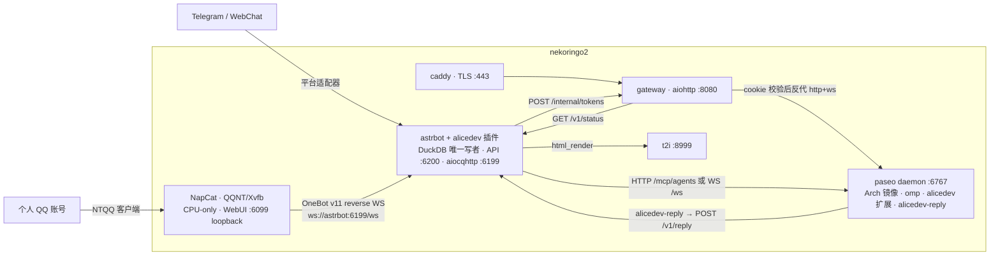
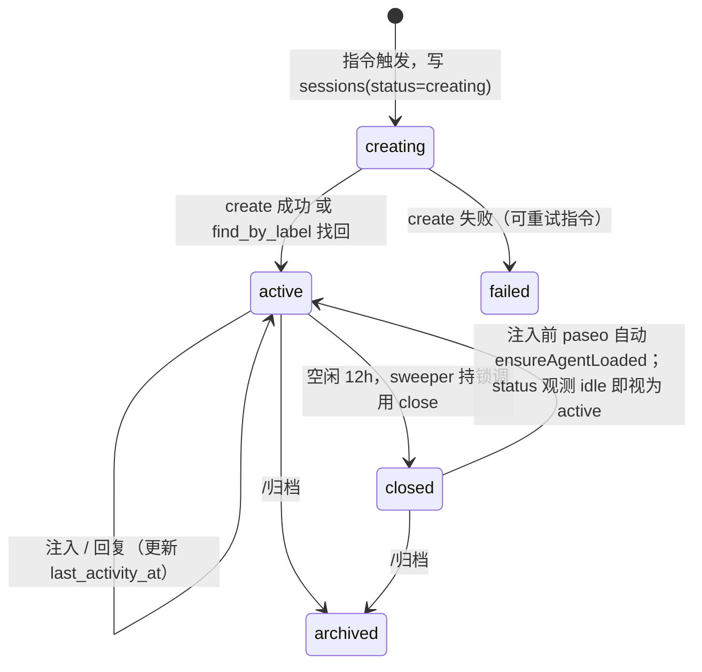

# alicedev 架构与契约（v2）

> 权威设计文档。所有切片按本文件的契约实现；契约变更必须先改本文件。事实依据见 `docs/research/*.md`。v2 吸收了两轮评审（`history://ReviewSteady`、`history://ReviewDivergent`）的结论；被否决的 v1 方案不再保留。

## 0. 一句话

AstrBot 插件把群聊指令变成 paseo 会话，paseo 里的 omp 通过 `alicedev-reply` 把回复送回群；网关用一次性 token 把 paseo 的工作区面板分享出去，并公开渲染调查报告。

## 1. 进程与容器（nekoringo2，docker compose，网络 `alicedev`）



| 进程 | 语言 | 职责 |
|---|---|---|
| `astrbot` + 插件 `bot/` | Python 3.11 | 指令、模板、需求/收藏、会话状态机、12h 空闲关闭、渲染、内部 API、GitHub 预取、报告发布 |
| `napcat` | QQNT / Xvfb | 个人 QQ 的生产协议端和 OneBot v11 reverse-WS 客户端；CPU-only，QQ/config/plugins 均在命名卷中，6099 只绑定宿主机 loopback |
| `gateway/` | Python 3.11 | 一次性 token → cookie、反代 paseo（含 WS 子协议注入）、报告 md 渲染、状态页 |
| `paseo`（fork `paseo-alicedev`） | TS | agent 运行时；fork 只做 embed 模式 + Arch 镜像 |
| `harness/omp-extension` | TS | `/chat_ingress` 命令、`chat_reply` 工具、`session_stop` 提醒 |
| `harness/reply-cli` | TS（node 单文件，零依赖） | `alicedev-reply`：POST `/v1/reply`，带重试 |
| `t2i`、`caddy` | 官方镜像 | HTML→PNG；ACME TLS |

**单写者**：只有 AstrBot 插件进程打开 `alicedev.duckdb`；所有存储变更经 `Store` 的单个 `asyncio.Lock`。其他进程通过 bot 内部 HTTP API。**没有** paseo 侧 sidecar，没有 TS bridge 服务。

**内部 API 传输**：docker 网络 HTTP + 头 `X-Alicedev-Token`，不映射主机端口（HANDOFF §9 的 unix socket 默认据此更新）。

**QQ 生产链路**：NapCat 是本项目必需的个人 QQ 协议端，加入 `internal`（反向 WS）和
`edge`（QQ 登录/消息出站）网络；AstrBot 在容器内监听 `0.0.0.0:6199`，宿主机不发布
6199。NapCat 的 WebUI 只通过 `127.0.0.1:6099` 和 SSH tunnel 管理。QQ 登录密码只在
隧道后的 WebUI 输入，不进入 Compose、`.env` 或仓库；设备身份和 WebUI 配置由命名卷持久化。

## 2. 标识符

| 名称 | 形式 | 说明 |
|---|---|---|
| `chat_key` | AstrBot `event.unified_msg_origin` | 群/私聊唯一键 |
| `user_key` | `<platform_id>:<sender_id>` | 用户唯一键 |
| `session_ref` | `s_` + 10 位 base32 | alicedev 会话 id，用户可见 |
| `msg_ref` | `m_` + 10 位 base32 | 每条注入消息 id；入站唯一键 `(chat_key, platform_message_id)` 防平台重投 |
| `reply_id` | 扩展生成 UUIDv4，每次工具调用一个，重试复用 | 回复幂等键 |
| `report_id` | `r_` + 26 位 base32（128 bit） | 报告公开 URL 的 bearer 能力 |
| `token` | 32 字节 urlsafe base64 | 一次性入口 |

## 3. 契约 A：Prompt 模板（`templates/prompts/*.md`）

frontmatter + Jinja2 正文。目录即注册表。

```yaml
---
name: requirement
trigger:
  command: 需求            # 或 link: github_issue | github_pr
aliases: [req]
description: 记录群友需求并交给 AI 分析
harness: omp              # 目前仅 omp；pi 待其适配落地后开放
model: anthropic/claude-sonnet-4-5   # 格式由 §7 映射表规定
effort: high              # off|minimal|low|medium|high|xhigh|max
cwd: /workspace/openalice # 默认 /workspace/alicedev
record: requirement       # 可选：同时写 requirements 表
reply:
  kinds: [text, image_template, sticker, file]
  image_templates: [requirement_summary, generic_card]
  text_templates: []
  stickers: [ok, thinking, confused]
  max_text_chars: 600
---
（Jinja2 正文 = 首轮 prompt。system 段也写在这里：paseo MCP create 没有 systemPrompt 字段，且 omp 的 system prompt 由用户自管。）
```

变量：`text`、`sender{id,name}`、`chat{key,name}`、`quoted{sender,text,images[]}`、`images[]`、`github{kind,owner,repo,number,title,body,labels[],state,url}`、`session_ref`。

bot 在渲染正文末尾追加「回复方式」段（由 `reply` 生成：可用 kinds/templates/stickers、`chat_reply` 用法、长内容必须走 image_template）。

## 4. 契约 B：bot → paseo 控制面

Python 内实现 `PaseoControl` 接口（`bot/alicedev/paseo/`），操作级契约固定，传输由 spike 决定：

| 操作 | 首选：`POST /mcp/agents`（MCP JSON-RPC `tools/call`，`Authorization: Bearer $PASEO_PASSWORD`） | 备选：WS `/ws` 协议 v1 |
|---|---|---|
| `create(session_ref, provider, model, thinking, cwd, title, initial_prompt)` | `create_agent`（**spike 修正：MCP 要求 `initialPrompt`+`provider` 必填**——ingress 命令即首轮 initialPrompt；`provider=<provider>/<model>`、`labels.alicedev=session_ref`、`settings.thinkingOptionId=<effort>`、`workspace.kind=create`、`relationship=detached`、`background=true`） | `create_agent_request{idempotencyKey: session_ref, labels}` |
| `find_by_label(session_ref)` | `list_agents` 过滤 label | `fetch_agents_request` |
| `send(agent_id, text)` | `send_agent_prompt` | `send_agent_message_request{messageId: msg_ref}` |
| `status(agent_id)` → idle/running/permission/closed/error | `get_agent_status` | `fetch_agents_request` |
| `close(agent_id)`（保留记录，可恢复） | `kill_agent`（= 内部 `closeAgent`，lifecycle→closed） | fork 新增 `close_agent_request`（仅在 MCP 路径不可用时） |
| `archive(agent_id)` | `archive_agent` | `close_items_request` |

spike 验收（已完成，2026-09-18，见 `docs/research/spike-results.md`）：MCP `POST /mcp/agents` 裸 `tools/call` 可用，**无需 `initialize` 握手、无需 daemon 自身 caller 上下文**；`create_agent` 的 `provider`+`initialPrompt` 为必填，故 ingress 命令改由 initialPrompt 承载（不再单独 send 首轮），omp 扩展仍在模型前拦截、msg id 不入上下文（已实测）。`kill_agent` = 可恢复 close（status→closed，记录保留）；对 closed agent `send_agent_prompt` 触发 paseo 自动 ensureAgentLoaded（status→running）实现 closed→active 自动恢复（已实测）。WS 备选与 fork `close_agent_request`（§9 第 3 项）无需实现。

**会话状态机（bot 是唯一执行者；每个 session_ref 一把 `asyncio.Lock` 作为租约）**



- 创建：写 `sessions(creating)` → `create`（ingress 命令作为 initialPrompt，omp 扩展在模型前拦截，msg id 不入模型上下文）→ 响应丢失时 `find_by_label`（label `alicedev=session_ref`）找回 → 写 `agent_id` → 转 `active`。
- 注入：持锁 → `status`；`running/permission` 则每 2s 轮询直到 idle（上限 10 min，超时回群「AI 仍在处理，稍后再试」）→ `send` → 写 `messages` → 更新 `last_activity_at`。同一会话严格串行；不同会话并行。
- 关闭：sweeper 每 10 min 扫 `status=active AND last_activity_at < now-12h`；持锁 → `status` 非 running/permission → `close` → `status=closed`。幂等。时钟只有一个：`sessions.last_activity_at`（注入时间与 `/v1/reply` 时间的较大者），随 DuckDB 持久化，重启不丢。
- 空闲关闭放在 bot 而非 paseo 侧车：只有 bot 同时看到注入与回复两个方向，且 paseo 无原生 idle 事件、公开 API 无 close 消息（`docs/research/paseo-api.md` §3）。

## 5. 契约 C：ingress 命令与 omp 扩展

omp 在 rpc/rpc-ui 下**不触发** `input` 事件（`oh-my-pi/.../types.ts:908`，`input-controller.ts:766`），但注册的扩展命令在模型之前被处理（`agent-session.ts:6126-6147`）。因此注入文本固定为：

```
/chat_ingress {"session":"s_…","msg":"m_…","text":"<渲染后的 prompt>"}
```

（单行 JSON；`text` 内换行按 JSON 转义。）

扩展 `harness/omp-extension`（核心逻辑在 `harness/core`，无 harness 依赖）：

1. `pi.registerCommand("chat_ingress")`：解析 JSON → `pending.push({session,msg,text})` → `pi.appendEntry("alicedev.pending", {session,msg})` → `pi.sendUserMessage(text)`。模型只看到 `text`。
2. `pi.registerTool("chat_reply")`：参数 = `ReplyPayload`（§6）。执行：生成/复用 `reply_id`；`pi.exec("alicedev-reply", ["--session", s, "--reply-id", id, "--msgs", "m1,m2", "--json", payload])`；退出码 0 且 stdout `{"status":"sent"|"replayed"}` → 把**当前全部 pending** 标记 consumed（`appendEntry("alicedev.consumed", {msgs, reply_id})`），返回成功；非 0 → 把 stderr 原样返回给模型，pending 不变。一条回复覆盖此前收到的所有消息（聊天语义）。
3. `pi.on("session_stop")`：若 `event.signal.aborted` 或 ctx 正在关闭 → 不干预。否则若 pending 非空且尚未对当前 pending 集合提醒过（`appendEntry("alicedev.reminded", {msgs})` 持久化）→ 返回 `{continue:true, additionalContext}`，内容为固定模板 + JSON 编码的原文（不拼接裸文本）。同一 pending 集合只提醒一次。
4. `session_start`：扫 `getBranch()` 重建 pending/consumed/reminded。
5. 加载方式：paseo custom provider `omp-alicedev`：`{extends:"omp", command:["omp","-e","/opt/alicedev/omp-extension"]}`（replace 模式，argv[0] 必须是 omp；`provider-registry.ts:833-862`，`omp/runtime.ts:83-88`）。不用 HOME 符号链接、不用 cwd 发现。

## 6. 契约 D：bot 内部 HTTP API（`http://astrbot:6200`，头 `X-Alicedev-Token`）

```ts
type ReplyPayload =
  | { kind: "text"; text: string; sticker?: string }
  | { kind: "text_template"; template: string; fields: Record<string, string>; sticker?: string }
  | { kind: "image_template"; template: string; fields: Record<string, unknown>; sticker?: string }
  | { kind: "sticker"; sticker: string }
  | { kind: "file"; path: string; caption?: string };   // path 在 REPORTS_ROOT 下

POST /v1/reply { session; reply_id; msgs: string[]; reply: ReplyPayload }
  → 200 { status: "sent" | "replayed"; platform_message_ids: string[]; report_url?: string }
  → 400 { error: invalid_payload | kind_not_allowed | template_unknown | path_outside_root | file_not_regular }
  → 404 { error: session_unknown }
  → 409 { error: reply_id_conflict }          // 同 reply_id 不同 payload 摘要
  → 502 { error: platform_send_failed; detail }
GET  /v1/sessions/{session} → { session, chat_key, template, status, reply_spec }
GET  /v1/status → { ok, generation, uptime_s, platforms[], commands[], templates[], sessions:{active,closed} }
GET  /v1/health → 200 { generation }         // reply-cli 重连探测
```

**回复语义（at-most-once + 幂等重放）**：`reply_deliveries(reply_id PK, session_ref, msgs, payload_sha256, state claimed|sent|failed, platform_message_ids, created_at)`。处理：持 Store 锁 → 若 `reply_id` 已存在：摘要相同 → 重放先前结果（`replayed`）；不同 → 409。否则写 `claimed` → 释放锁 → 平台发送 → 写 `sent`/`failed`。`sent` = 适配器 `send` 返回成功，不承诺对端已读。发送后进程崩溃 → 状态停留 `claimed`，重试返回 409？否：`claimed` 超过 60s 视为 `unknown` 并允许重试（可能重复，文档化）。

**长内容不变量**：`text` 超过 `max_text_chars` → bot 自动改走 `generic_card` 图片模板，不拒绝。

**`kind:"file"` 发布**：bot 校验 `os.path.realpath(path)` 以 `REPORTS_ROOT/` 为前缀、`lstat` 为常规文件、路径各段无符号链接；生成 `report_id`；原子复制到 `REPORTS_ROOT/_published/<report_id>/<basename>`（临时文件 + rename）；写 `reports`；`.md` → 回群 `https://<host>/_alicedev/r/<report_id>/<basename>`；其他扩展名 → 以文件组件发送。

**插件生命周期**：`initialize()`：打开 Store（一次）→ 启动 aiohttp `TCPSite`（`reuse_port`）→ 启动 sweeper/outbox 任务；`generation` 自增。`terminate()`：标记 draining（`/v1/*` 返回 503）→ 等待在途请求 ≤10s → 取消并等待任务 → 关站 → 关 Store。reply-cli 遇 503/连接拒绝按 1,2,4,8s 重试至 30s。

## 7. 契约 E：harness → paseo provider 与参数映射

| 模板 `harness` | paseo provider id | `model` 传递 | `effort` 传递 |
|---|---|---|---|
| `omp` | `omp-alicedev`（daemon 配置 custom provider，见 §5.5；基础 `omp` provider 需启用） | **spike 确认**：paseo catalog `provider/model`（如 `anthropic/claude-fable-5-1`）；create_agent 的 `provider` 字段传 `omp-alicedev/<provider>/<model>` | `settings.thinkingOptionId`（omp `--thinking` 同名级别，如 `high`） |

bot 持久化解析后的实际值到 `sessions(provider, model, thinking)`。

## 8. 契约 F：网关

**威胁模型（明确决定）**：分享链接的接收者是社区内受信开发者。token 门槛阻止外部人进入；一旦持有 cookie，即可使用整个 paseo daemon UI（embed 只是 UX 收敛，不是授权边界）。报告是公开 bearer URL（128 bit id），因为它们被贴进群供多人反复打开。

- `GET /t/<token>` 与 `HEAD /t/<token>`：单进程校验 token 并 `peek`，**不消费**；
  返回 preview landing（`Cache-Control: no-store`、`Referrer-Policy: no-referrer`、
  `X-Robots-Tag: noindex`）。GET 页面用 JavaScript 自动向同一路径提交 `POST`，
  同时保留可见按钮 fallback；HEAD 只返回 headers，不消费 token。
- `POST /t/<token>`：无 `await` 的单进程原子 consume；成功设 cookie
  `alicedev_s=<b64url(json{iat,exp,sub})>.<hmac-sha256>` 并返回 `303 See Other`
  到 `/_alicedev/?go=<urlencoded target>`；`Path=/; Secure; HttpOnly; SameSite=Lax;
  Max-Age=2592000`；服务端校验 `exp`，常量时间比较 HMAC。无效/已消费/过期返回 403。
- cookie 校验：除 `/t/*`、`/_alicedev/r/*`、`/_alicedev/static/*`、`/_alicedev/health` 外全部要求合法 cookie；失败 → 403 页面。
- `/_alicedev/`：状态页（取 bot `/v1/status`），显示 bot 状态、命令、模板列表与「进入会话」按钮（`go`）。
- `/_alicedev/r/<report_id>/<basename>`：只读挂载 `REPORTS_ROOT/_published`；`report_id` 正则 `^r_[a-z2-7]{26}$`，`basename` 不含 `/`、`..`；`.md` → markdown-it-py（`html=False`）+ mdit-py-plugins（table、strikethrough、footnote、tasklists、deflist、front_matter、texmath）+ pygments；mermaid 客户端渲染（自带静态 js，`securityLevel:"strict"`）；其他扩展名白名单直出。响应头 `X-Robots-Tag: noindex`，`Referrer-Policy: no-referrer`；无目录列表。
- 其余路径 → 反代 `http://paseo:6767`。HTTP：注入 `Authorization: Bearer $PASEO_PASSWORD`。WS：网关终止浏览器 WS（不转发浏览器的 `Sec-WebSocket-Protocol`/`Authorization`），另起上游 WS，带 `Authorization` + 子协议 `paseo.bearer.<pw>`，双向泵；不把上游子协议回显给浏览器。上游 `Host`=公共域名（paseo 需 `PASEO_HOSTNAMES=alicedev.237575.xyz`）；`Origin` 置为 `https://alicedev.237575.xyz` 或不发。
- `PASEO_PASSWORD` 必须非空（为空时 MCP 与 WS 无鉴权）。
- 访问日志脱敏：`/t/<token>` 记为 `/t/***`；不记录 cookie。

## 9. 契约 G：paseo fork（`mouriya-s-lab/paseo-alicedev`，基于 `mouriya-s-lab/paseo` main `7ab7c444d`，含 PR#2）

1. **embed 模式**（`packages/app/src/fork-features/embed/`）：`?embed=1` → 不渲染 `LeftSidebar`/`SidebarChrome`，隐藏主面板内的导航逃逸（清单 `docs/research/paseo-app-embed.md` §4）；`embed` 在 agent→workspace 重定向中保留；首次加载 host 注册竞态（`host-runtime.ts:1531-1568`）修复为等待 bootstrap 完成再解析 `/h/<serverId>` 路由。公开 URL 只用已知 workspace 形式。
2. **Arch 镜像**（`docker/arch/Dockerfile`）：保持契约（uid/gid 1000、`/home/paseo`、`/workspace`、`PASEO_LISTEN=0.0.0.0:6767`、`/api/health`、tini+gosu 等价）；Arch builder/runtime 同一 Node 大版本；安装 `omp`（bun）、`git`、`gh`；`/opt/alicedev/{omp-extension,reply-cli}` 由 build arg 指定的 alicedev 构建产物 COPY。daemon 配置模板启用 `omp` 并声明 `omp-alicedev`。
3. `close_agent_request`：仅当 §4 spike 判定 MCP 路径不可用时实现。
4. 每项独立 issue + PR；trunk 接线记入 `fork-features/trunk-patches.md`。

## 10. 契约 H：指令与权限

配置（`bot/_conf_schema.json`）：`allowed_chats: string[]`（chat_key 白名单；空 = 全部允许）、`admin_users: string[]`（user_key）、`paseo_url`、`paseo_password`、`internal_token`、`gateway_url`、`public_base_url`、`reports_root`、`github_token?`、`default_repo: TraderAlice/OpenAlice`。中间件顺序：白名单 → 指令解析 → 权限 → handler；拒绝时私下不回（避免刷屏），日志记录。

| 指令 | 权限 | 行为 |
|---|---|---|
| `/<模板 command> <text>` | 所有人 | 渲染 → `creating` → create → ingress send；`record: requirement` 写需求表；回「已创建 s_xxx」 |
| `/继续 <s_ref> <text>`；或引用 bot 消息 + 文本 | 所有人 | 注入。引用解析：`outbound(platform_message_id)` → 恰一 session 且 `chat_key` 相同，否则忽略 |
| `/收藏`（引用一条消息） | 所有人 | favorites（原作者、文本、图片落盘 `data/plugin_data/alicedev/images/`、收藏人）；回「已收藏 #n」 |
| `/收藏夹 [page]`、`/需求列表 [page]` | 所有人 | 卡片图，每页 10 条，页脚 `第 x/y 页 · /收藏夹 n` |
| `/链接 [s_ref] [@A @B …]` | 管理员 | 每个 @ 用户一个 token（`user_key` 记入）；无 @ 给发起人；无 s_ref 取本群最近 active 会话；逐条 `[At, Plain(url)]` |
| `/解读 <url|#n>`；或消息仅含 issue/PR 链接 | 所有人 | REST 预取（`github_token` 可选）→ 模板 `github-issue`/`github-pr` |
| `/归档 <s_ref>` | 管理员 | archive + `archived` |
| `/alicedev` | 所有人 | 通过 `CardRenderer` 发送图片帮助卡，包含当前会话名称/状态与常用命令、路由说明；渲染失败时才回退为文本帮助 |

分发：单个 `@filter.regex(r"^[/／]")` 入口 + `CommandRegistry`；模板指令由 `TemplateRegistry` 在 `initialize()` 注册。

## 11. DuckDB schema（`bot/alicedev/store/schema.sql`，`schema_version` 表）

```sql
sessions(session_ref PK, chat_key, template, provider, model, thinking, agent_id, workspace_id, server_id,
         status, created_by, created_at, last_activity_at)
messages(msg_ref PK, session_ref, chat_key, platform_message_id, sender_key, text, created_at,
         UNIQUE(chat_key, platform_message_id))
reply_deliveries(reply_id PK, session_ref, msgs JSON, payload_sha256, state, platform_message_ids JSON, created_at, updated_at)
outbound(platform_message_id PK, chat_key, session_ref, created_at)
requirements(id PK, chat_key, session_ref, author_key, author_name, text, images JSON, status, created_at)
favorites(id PK, chat_key, saver_key, saver_name, author_key, author_name, text, images JSON, platform_message_id, created_at)
reports(report_id PK, session_ref, source_path, published_path, created_at)
tokens_issued(token_id PK, session_ref, user_key, issued_by, target, issued_at, expires_at)   -- 审计
```

## 12. 部署（`deploy/`）

- `docker-compose.yml`：caddy、gateway、astrbot、**napcat**、t2i、paseo；`.env.example`：`ALICEDEV_HOST`、`TELEGRAM_BOT_TOKEN`、`PASEO_PASSWORD`、`ALICEDEV_INTERNAL_TOKEN`、`GATEWAY_SECRET`、`ASTRBOT_DASHBOARD_INITIAL_PASSWORD`、`NAPCAT_ONEBOT_TOKEN`、`GITHUB_TOKEN?`。
- 卷：`astrbot_data`；`napcat_qq`、`napcat_config`、`napcat_plugins`（NapCat 运行身份、配置和插件）；`paseo_home`（含 omp 配置，用户自管）；`workspace`；`reports`（paseo 与 astrbot 同路径挂载 `/srv/alicedev/reports` rw；gateway 挂 `/srv/alicedev/reports/_published` ro）。
- NapCat 镜像固定为 `mlikiowa/napcat-docker:v4.18.28@sha256:41b1a8e10953065f4796ab19c0c8760cd3175376be976c5480710d29a77357ee`（`linux/amd64`、CPU-only）；只绑定宿主机 `127.0.0.1:6099`，不发布 `6199`。
- paseo 镜像在 nekoringo2 由 compose `build` 从 `paseo-alicedev` 检出构建；harness 产物由 alicedev 仓库 `make harness` 生成后作为 build context 传入。
- AstrBot 插件 bind mount `./bot` → `/AstrBot/data/plugins/alicedev`；`cmd_config.json` 预置 `telegram` + `webchat` + `aiocqhttp`（reverse WS `0.0.0.0:6199`、`${NAPCAT_ONEBOT_TOKEN}`）+ `t2i_endpoint=http://t2i:8999`。
- DNS：`alicedev.237575.xyz` A 已手工建（HANDOFF §7）；runbook 记录迁入 `pve-vctcn/apps/dns` 的后续 issue。
- QQ 生产 onboarding 采用操作员选定的 NapCat WebUI 密码登录；密码、新设备验证和后续重连按 `docs/runbook.md` §7 执行，当前文档不声称登录已完成。

## 13. 仓库布局

```
bot/                      AstrBot 插件
  metadata.yaml main.py _conf_schema.json requirements.txt
  alicedev/commands/      CommandRegistry, handlers
  alicedev/templates/     frontmatter loader, Jinja, reply_spec
  alicedev/store/         duckdb, schema.sql, repositories
  alicedev/paseo/         PaseoControl(接口) + mcp.py / ws.py, session_actor.py, sweeper.py
  alicedev/render/        cards (html_render), pagination
  alicedev/api/           aiohttp 内部 API
  alicedev/github/        链接解析与预取
  alicedev/reports.py     发布
templates/prompts/ templates/cards/ templates/stickers/
harness/core/ harness/omp-extension/ harness/reply-cli/
gateway/
deploy/
docs/research/ docs/runbook.md
```

## 14. 交付顺序

1. **Spike（真实边界，产出即正式代码）**：本机 OrbStack 跑 AstrBot(webchat)+t2i；本机原生跑 paseo daemon（`paseo-alicedev` 检出，启用 omp + `omp-alicedev`）；实现 `bot/alicedev/paseo/*`、`harness/*`、`bot/alicedev/api`、最小 `/需求` + `messages/reply_deliveries`。证明：WebChat `/需求` → create（无 initialPrompt）→ ingress send → 扩展命令收到、模型看不到 msg → `chat_reply` → `/v1/reply` → WebChat 出现回复；`session_stop` 提醒在未回复时触发一次；关闭 + 再注入自动恢复。回写 §4/§7。
2. **并行切片（契约已定）**：gateway；embed 模式；Arch 镜像；store + 需求/收藏/列表卡片 + 分页；模板 loader + GitHub 预取 + `/解读`；`/链接`；`/收藏`；runbook + compose。
3. **集成**：nekoringo2 部署，TLS，WebChat 端到端，`/链接` 分享页浏览器验证（冷加载/刷新），报告渲染验证（mermaid、高亮、CJK）。
