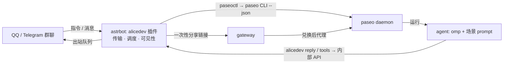

# alicedev

OpenAlice（https://github.com/TraderAlice/OpenAlice）开发者社区的 QQ / Telegram 机器人，以 AstrBot 插件形态运行，把群聊接到 paseo agent 开发环境。程序指令管理独立需求记录、收藏、会话、列表、帮助、分享与审批；`/需求` 只记录原文，不开启 AI，不改变当前会话，`/需求列表` 与 `/收藏夹` 是两份列表。AI 指令 `/帮我调查`、`/解读`、`/管家` 开单对话态会话，`/升级bot` 走 issue → PR → 审批 → merge → 部署的多状态场景，用户用本群 `%n` 指代会话。指令与场景由 `templates/` YAML DSL 声明。agent 经独立 typed tools 查询、保存记录和指派研究，不反过来发送 QQ/TG 指令；管家可请求 bot 直接投递 paseo 链接，tool 结果只含投递 receipt，不含 bearer URL。



## 文档

| 文件 | 内容 |
|---|---|
| `AGENTS.md` | 在本仓库工作的规则（先读） |
| `ARCHITECTURE.md` | 契约：容器拓扑、DSL、控制面、回复与 transition、调度状态机、网关、schema、部署契约 |
| `.omp/rules/deploy.md` | 部署规则：闸门、体检、按改动类型上线、核验、凭据、回滚 |
| `docs/runbook.md` | 部署以外的宿主操作：TG / QQ 登录、dashboard、已知限制 |
| `tools/README.md` | shim 与运维 CLI（`paseoctl`、`deployctl`、`deployrun`、`mainsync`、`e2e_driver.py`、`tgctl`） |
| `gateway/README.md` | 网关配置与行为 |
| PR 正文 | 每次改动的验收证据（仓库里不存证据文件） |

## 目录

```
bot/        AstrBot 插件（DSL 加载与校验、动作、调度、paseo 控制、出站队列、DuckDB、卡片渲染、内部 API）
templates/  指令、路由、场景、回话、卡片的 DSL
harness/    paseo 里 agent 用的 omp 扩展、alicedev CLI 与 skill
gateway/    分享链接兑换、paseo 代理、报告发布
tools/      跨容器 shim 与运维 CLI
deploy/     compose 与各容器的 Dockerfile / 配置（生产、dev、e2e、tg-cli）
```

## 本地开发

```sh
# bot：DSL 校验、出图、测试（在 bot/ 下）
cd bot
uv run --with-requirements requirements.txt --with pytest --with pytest-asyncio python -m alicedev.dsl check ../templates
uv run --with-requirements requirements.txt --with pytest --with pytest-asyncio python -m alicedev.dsl card <指令名|场景名>
uv run --with-requirements requirements.txt --with pytest --with pytest-asyncio python -m pytest -q

# gateway
cd gateway && uv run --with . --with pytest --with pytest-asyncio python -m pytest -q

# harness
cd harness && npm ci && npm test && npm run build
```

改了 DSL 必须跑 `dsl check`，并看 `dsl card` 出的图。单测只作辅助：功能要在真实 e2e 里跑通才算完成（`AGENTS.md` §3）。

## 部署

生产在 nekoringo2。平时 bot 与 DSL 的改动经 `/升级bot` 批准后自动部署；其余改动和手工部署按 `.omp/rules/deploy.md` 执行。
